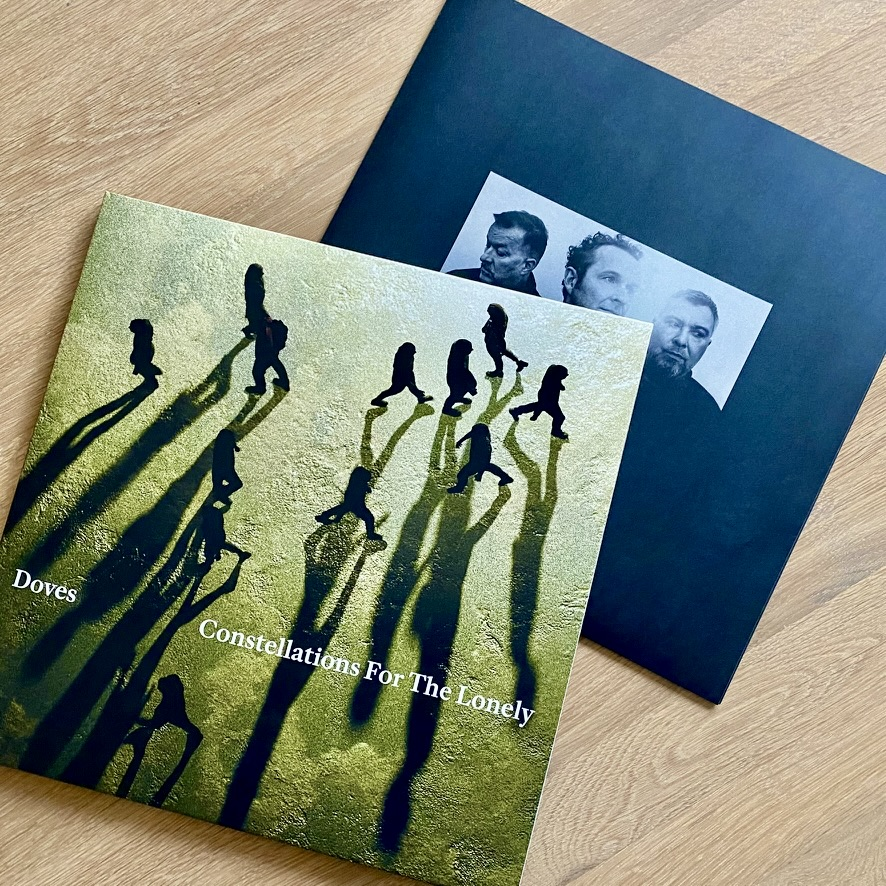
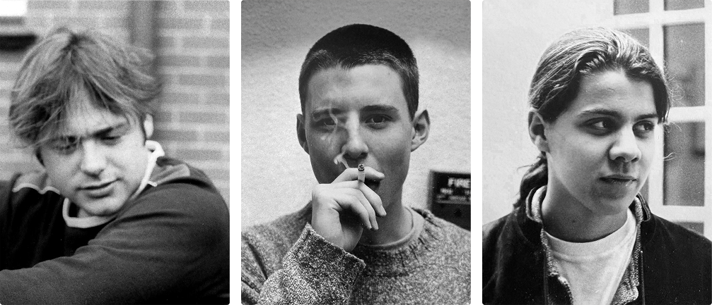
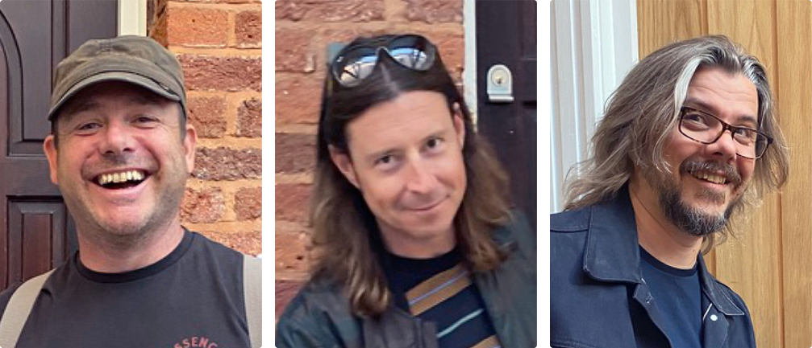
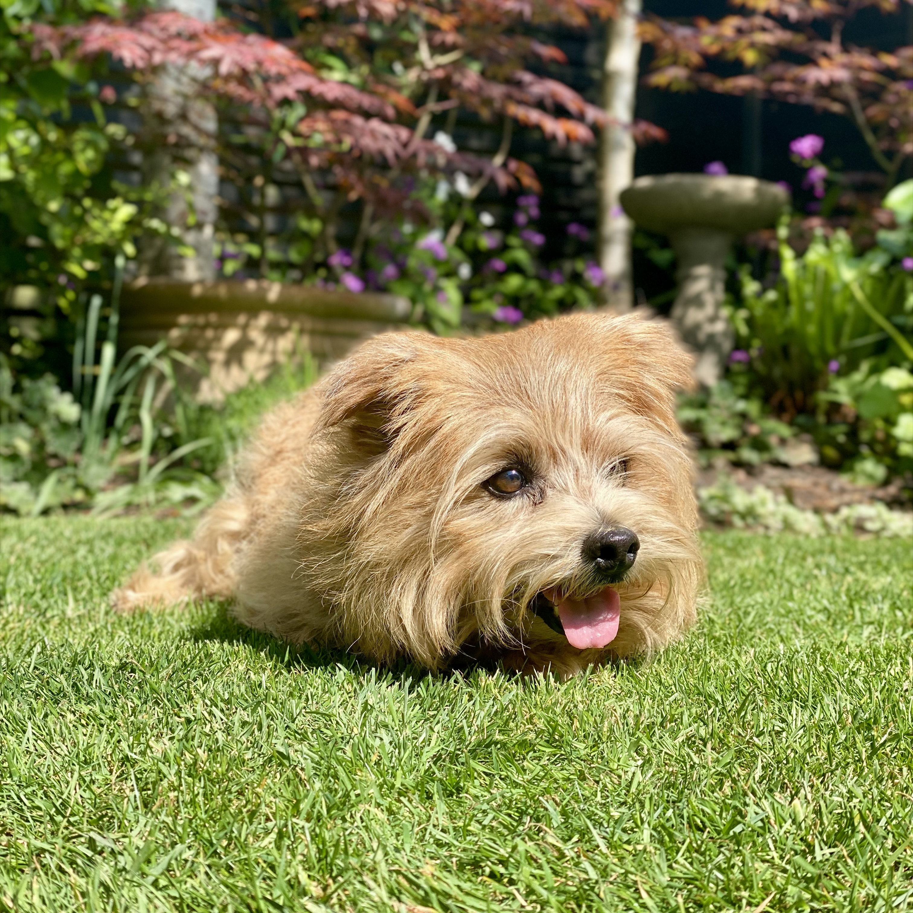
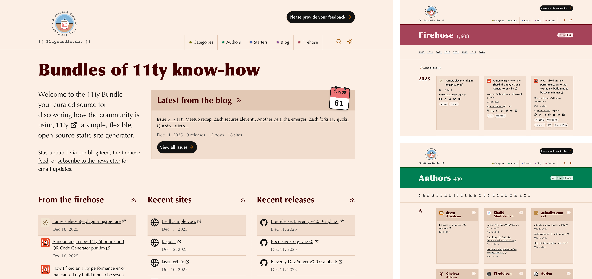
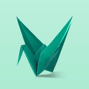
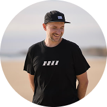
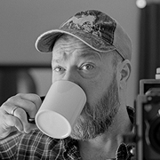



.prose {
  container-type: inline-size;
}

.reading,
.crucial-tracks,
.tv-and-movies,
.now-and-then,
.articles,
.bundle {
  border-radius: var(--border-radius);
  display: flex;
  flex-direction: column;
  gap: var(--flow-space);
  padding: var(--flow-space);
}

.chart__container {
  display: grid;
  grid-template-columns: 1fr;
  gap: var(--flow-space);
  div {
    min-width: 0;
  }
}

@container (min-width: 50ch) {
  .chart__container {
    grid-template-columns: 1fr 1fr;
    align-items: start;
  }
}

.crucial-tracks {
  blockquote {
    font-size: var(--text-size-0);
    text-wrap: balance;
    border-left: unset;
    padding-inline-start: unset;
  }
}

@container (min-width: 50ch) {
  .crucial-tracks {
    .illustrated-content {
      grid-template-columns: 200px 1fr;
    }
    blockquote {
      order: 2;
    }
  }
}

.shows,
.articles__list {
  display: grid;
  grid-auto-flow: column;
  grid-auto-columns: minmax(220px, 1fr);
  gap: var(--space-2xs);
  overflow-x: auto;
  overflow-y: hidden;
  overscroll-behavior: contain;

  @supports (scrollbar-color: auto) {
    scrollbar-color: var(--surface-mid) transparent;
    scrollbar-width: thin;
  }

  @supports selector(::-webkit-scrollbar) {
    &::-webkit-scrollbar {
      background: transparent;
      width: 6px;
      height: 6px;
    }
    &::-webkit-scrollbar-thumb {
      background: var(--surface-mid);
      border-radius: 3px;
    }
  }
}

.shows {
  margin-block-start: 0;
}

.reveal {
  --pos: 50%;
  position: relative;
  display: grid;
  > * {
    grid-area: 1 / -1;
  }
  .then {
    mask: linear-gradient(to right, #000 0, var(--pos), transparent 0);
  }
  .now {
    mask: linear-gradient(to right, transparent 0, var(--pos), #000 0);
  }
  input[type="range"] {
    appearance: none;
    opacity: 0;
    background: transparent;
    z-index: 1;
    cursor: ew-resize;
  }
}

.articles__list {
  margin-block: unset;
  padding-inline-start: unset;
}

.shows__item {
  display: flex;
  flex-direction: column;
  gap: var(--space-3xs);
  background: var(--surface-back);
  border-radius: var(--border-radius-s);
  padding: var(--space-2xs);
  font-size: var(--text-size--1);
  h4 {
    flex: 1;
    font-size: var(--text-size-1);
    font-variation-settings: "wght" 400, "wdth" 75;
    span {
      display: block;
    }
    [lang="en"] {
      font-size: var(--text-size-0);
    }
  }
  img {
    border-radius: var(--border-radius-s);
  }
  dl {
    margin-block-start: unset;
  }
  dd {
    margin-block-end: unset !important;
  }
}

.articles__list {
  li {
    display: flex;
    flex-direction: column;
    gap: var(--space-3xs);
    background: var(--surface-back);
    border-radius: var(--border-radius-s);
    padding: var(--space-2xs);
  }
  h4 {
    font-size: var(--text-size-1);
    font-variation-settings: "wght" 400, "wdth" 75;
  }
  a {
    text-decoration-color: inherit;
  }
  p {
    font-size: var(--text-size--1);
    margin-block-start: unset;
  }
}

.illustrated-content {
  display: grid;
  gap: var(--gutter);
  p {
    margin-block-start: unset;
  }
  img {
    border-radius: var(--border-radius-s);
  }
}

@container (min-width: 50ch) {
  .illustrated-content {
    grid-template-columns: 1fr 220px;
    align-items: start;
  }
}

.bundle {
  figcaption {
    order: -1;
    text-align: unset;
    margin-block-start: unset;
  }
  img {
    border-radius: var(--border-radius-s);
  }
}

.reading-list {
  display: grid;
  gap: var(--flow-space);
  padding-inline-start: unset;
  li {
    display: grid;
    column-gap: var(--space-xs);
    row-gap: var(--space-3xs);
    align-items: start;
    align-content: start;
    grid-template-columns: auto 1fr;
    grid-template-rows: auto;
    grid-template-areas:
      "img title"
      "img meta";
  }
  h3 {
    grid-area: title;
    font-size: var(--text-size-1);
    font-variation-settings: "wght" 400, "wdth" 75;
  }
  a {
    text-decoration-color: inherit;
  }
  p {
    grid-area: meta;
    margin-block-start: unset;
  }
  picture {
    grid-area: img;
    width: var(--space-xl);

  }
  img {
    height: 100%;
    aspect-ratio: 1;
    object-fit: contain;
    border-radius: var(--border-radius-s);
  }
}

@container (min-width: 50ch) {
  .reading-list {
    grid-template-columns: repeat(2, 1fr);
  }
}


I've always enjoyed reading end-of-year summaries—you know the kind, where *actual* people reflect on what they've read, watched, listened to, or been otherwise occupied with over the year. I've discovered great recommendations this way and appreciated them all the more because they felt personal, especially compared with the flat-packed recaps currently in vogue. It's something I've wanted to do myself for a long time, and starting now seems *more* rather than *less* relevant to me. This is the first year I have all that data to hand, where I can reference and reflect on it without piecing together information from a patchwork of platforms and services.

## Reading
I read [34 books in 2025](https://damianwalsh.co.uk/reading/years/2025/)—down from [44 in 2024](https://damianwalsh.co.uk/reading/years/2024/). I can't think why this would be. If anything, I was even less occupied with commercial work this year than last. So I certainly should have had the time, if not necessarily the money. Reading, in this economy?

  <h3 class="meta">Reading by Month: 2024 vs 2025</h3>
  <canvas id="readingByMonthChart"></canvas>

Looking at the data, I read more consistently throughout 2024, while 2025 was marked by sharper peaks and troughs of activity. I started strong—reading a respectable six books in January—but couldn't maintain the pace. I managed only two in February, one in March, before petering out entirely in April. Was I focused on personal projects and writing more, or something else? I redeemed myself in August, finishing nine books—mostly page-turners, admittedly—while recharging my batteries and enjoying the fine weather around then.

  <h3 class="meta">Reading by Genre: 2024 vs 2025</h3>
  

    

      <canvas id="genres2024Chart"></canvas>
    

    

      <canvas id="genres2025Chart"></canvas>
    

  

In 2024, I read mostly historical fiction and crime novels before becoming slightly obsessed with space opera. [James Clavell](https://damianwalsh.co.uk/reading/authors/james-clavell/)'s Asian Saga—particularly the sweeping, epic [Shōgun](https://damianwalsh.co.uk/reading/works/shogun-james-clavell/), with its vivid descriptions of the terrible beauty and cruelty of 16th-century Japan—was my favourite book of the year. This year, apart from a couple of notable exceptions, including Brian Eno's diary [A Year With Swollen Appendices](https://damianwalsh.co.uk/reading/works/a-year-with-swollen-appendices-brian-eno/) in January, which signposted the way to creative rejuvenation for me, science fiction has been the only game in town. I very much enjoyed [Iain M. Banks](https://damianwalsh.co.uk/reading/authors/iain-m-banks/)' Culture series. The scope of the storytelling felt more expansive compared with other novels in the genre I've read this year. Are present circumstances driving me towards escape into outer space and the future? Maybe…

## Music
The trend of not going to gigs continues. Crippling anxiety and panic attacks in crowded, confined spaces remain a real and ongoing drag. As annoying and inconvenient as that is, it didn’t stop me engaging with music in other ways—I worked on my [music collection project](https://damianwalsh.co.uk/posts/creating-connections-with-music-and-technology/) on and off throughout the year. In October, I stumbled across [Jason Dettbarn](https://jasondettbarn.com/)'s wonderful and generous [Crucial Tracks](https://app.crucialtracks.org/) project, a slow social music app that's perfectly suited to this kind of reflective listening and sharing. I've been using it to journal my thoughts about the music I already own, really listening to the whispers and echoes from the past and what they are telling me.

  <h3 class="meta">27 Oct 2025: What song best captures your current phase of life?</h3>
  

  
  <blockquote>From time to time, <a href="https://damianwalsh.co.uk/music/releases/stanley-road-paul-weller-vinyl/">The Changingman</a> by Paul Weller resonates with me. Thinking about where I am and how I'm feeling right now—in truth, perhaps over the last couple of years—I might need to pay heed to the song's message: when you're stuck in a rut, you need to shake things up.</blockquote>
  

It's been a fruitful exercise, and I hope to maintain the practice and find ways to weave [these scribbles](https://app.crucialtracks.org/profile/damianwalsh) back into my music collection. Some might question its purpose or utility, or argue about what it is and how to categorise it, but for me, the difference lies in ownership—it's built to my preferences and specifications, and ultimately benefits me first and foremost.

  
The only new music I acquired this year was <a href="https://damianwalsh.co.uk/music/releases/constellations-for-the-lonely-doves-vinyl/">Constellations For The Lonely</a> by Doves—a thoughtful and gratefully received gift. It's lovely, by the way, and so good to hear Jimi Goodwin's melancholy baritone on record again.

  

## TV and movies
I haven't gotten around to building a way to record the TV shows and movies I've watched—something to add to my 2026 to-do list. In any case, this has been a fairly quiet year. I can't recall going to the cinema even once and haven't felt the need to put any more money in the pockets of commercial streaming services. God only knows what they'd do with it. That said, I really enjoyed working my way through a backlog of world drama series on [Channel 4](https://www.channel4.com/collection/walter-presents).

  <h3 class="meta">TV highlights</h3>
  

  
  <article class="shows__item">
    <h4>
      {{ show.title }}
       ({{ show.titleEn }})
    </h4>
    
    <dl class="meta">
      <dt class="visually-hidden">Language:</dt>
      <dd>{{ show.language }}</dd>
      <dt class="visually-hidden">Years:</dt>
      <dd>{{ show.years }}</dd>
    </dl>
    <a href="{{ show.imdb }}">IMDb</a>
  </article>
  
  

## Health and relationships
I turned 49 in September. All things considered, I feel pretty good. I'm not ready to be consigned to the scrap heap, knacker's yard, or glue factory just yet. This year also heralded 30 years since going off to university, and I marked the occasion by returning to Exeter for a reunion with contemporaries. It was a wonderful, life-affirming trip down memory lane. A tidal wave of fond recollections from the time I spent there in the 1990s came crashing back: scrumpy cider, square pizza, bar billiards, being addressed as "my lover" by strangers in broad West Country accents, and most of all, memories connected with my buddies Steve and Al. There was a long period when I measured success differently, but my perspective has shifted. I now find myself more grateful to have made and kept some good friends. I love you guys!

  <h3 class="meta">Now and then</h3>
  

    
    
    <input type="range" min="0" max="100" value="50" id="reveal-slider">
  

**Side note:** apart from the fact we all looked a whole lot more winsome as callow youths, I noticed how much better the photos from back then look compared with the pictures taken recently using iPhones. Those old shots were all captured on a Canon AE-1 (technology from the 1970s!), and we processed the film and developed prints ourselves in the university's darkroom. Progress isn't always what marketing wants you to believe, bro…

## Travel

  
An ageing dog and cost-of-living concerns circumscribed my perambulations this year. I'm not complaining—getting a little dog, looking after him and letting him look after me is the best thing I ever did, and I know that I'm very lucky to live a relatively comfortable life. That said, I hope my horizons expand beyond suburban Manchester in my next—and fiftieth—circuit around the sun.

  

## Work and career
By some measures, a quiet year with little to report. I've been indifferent to the commercial world this year, and it responded in kind. But I haven't let the grass grow beneath my feet. After some bruising experiences, I started the year with a sketchy plan to [build a digital garden](https://damianwalsh.co.uk/posts/cultivating-a-digital-garden/) and write about my efforts as a way to rediscover my professional identity.

Including this post—which I suspect will be the last I manage to cast off this year—I wrote [seven posts in 2025](https://damianwalsh.co.uk/posts/), with a total word count of **12,823**, all connected to the project in some way. As someone who has previously struggled with self-doubt when writing and sharing my thoughts and feelings, I'm proud of this growing body of work, which more honestly reflects my own interests and motivations, and I now find myself able to think, write, and publish with greater confidence and speed.






  
    
  


  <h3 class="meta">Articles published in 2025</h3>
  <ol role="list" class="articles__list">
  
  <li>
    <h4><a href="{{ post.url }}">{{ post.data.title }}</a></h4>
    
{{ post.data.description }}

    

      <time datetime="{{ post.date | isoDateString }}">{{ post.date | readableDate }}</time>
       (Updated <time datetime="{{ post.data.updated | htmlDateString }}">{{ post.data.updated | readableDate }}</time>)
    

  </li>
  
  </ol>

In November, I worked with [Bob Monsour](https://bobmonsour.com/) on a redesign of his wonderful resource, the [11ty Bundle](https://11tybundle.dev/). Working together, we completely rebuilt the website from the ground up. Big thanks to Bob for taking a leap of faith and involving me in the design and front-end work. What a great guy—I had fun collaborating on this project. And it feels good to put something back into the [Eleventy](https://www.11ty.dev/) community, which has been a brilliant experience overall.

<figure class="bundle surface">
  
  <figcaption class="meta">11ty Bundle</figcaption>
</figure>

I now find myself in quite a different place to where I stood at the beginning of this year, questioning everything about what I do—and how and why I do it. I feel better about myself, the way I see things, what I do, and what I can offer. And really, that is enough—I am enough. It's taken the best part of a year to get here, but going into 2026, my compass is set in the right direction again. Optimism and hope, not fear and pessimism.

<figure>
  <blockquote>
  
"I don’t really believe in luck; things happen to everyone, but you have to be ready for them."

  </blockquote>
  <figcaption class="meta">Brian Eno</figcaption>
</figure>

## Further reading
In the course of thinking about and writing this post over the holiday period, a few other examples I really enjoyed were also published.

<ul role="list" class="reading-list">
  <li>
    <h3><a href="https://bell.bz/wrapping-up-2025-sort-of">Wrapping up 2025 (sort of)</a></h3>
    
Andy Bell

    
  </li>
  <li>
    <h3><a href="https://dbushell.com/2025/12/18/year-in-review">I Survived 2025</a></h3>
    
David Bushell

    
  </li>
  <li>
    <h3><a href="https://vale.rocks/pulse/2025">Feeling The Pulse of Twenty Twenty-Five</a></h3>
    
Declan Chidlow

    
  </li>
  <li>
    <h3><a href="https://www.nicchan.me/blog/2025-recap">2025 Recap</a></h3>
    
Nic Chan

    
  </li>
  <li>
    <h3><a href="https://colly.com/journal/twenty-twentyfive-in-music">2025 in music</a></h3>
    
Simon Collison

    
  </li>
  <li>
    <h3><a href="https://joshcollinsworth.com/blog/2025">2025 Year in Review</a></h3>
    
Josh Collinsworth

    
  </li>
  <li>
    <h3><a href="https://www.coryd.dev/posts/2025/2025-in-review">2025 in review</a></h3>
    
Cory Dransfeldt

    
  </li>
  <li>
    <h3><a href="https://flamedfury.com/posts/books-i-read-in-2025">Books I Read in 2025</a></h3>
    
Flamed Fury

    
  </li>
  <li>
    <h3><a href="https://pawelgrzybek.com/a-look-back-at-2025">Look Back at 2025</a></h3>
    
Paweł Grzybek

    
  </li>
  <li>
    <h3><a href="https://nazhamid.com/journal/music-in-2025">Music In 2025</a></h3>
    
Naz Hamid

    
  </li>
  <li>
    <h3><a href="https://chriskirknielsen.com/blog/yearnotes-2025">Yearnotes 2025</a></h3>
    
Christopher Kirk-Nielsen

    
  </li>
  <li>
    <h3><a href="https://axel.leroy.sh/blog/retrospective-2025">Looking back on 2025</a></h3>
    
Axel Leroy

    
  </li>
  <li>
    <h3><a href="https://cassey.dev/2025-in-review">Looking Back on 2025</a></h3>
    
Cassey Lottman

    
  </li>
  <li>
    <h3><a href="https://loige.co/2025-a-year-in-review">2025 - A year in Review</a></h3>
    
Luciano Mammino

    
  </li>
  <li>
    <h3><a href="https://ethanmarcotte.com/wrote/our-frail-thoughts">Our frail thoughts</a></h3>
    
Ethan Marcotte

    
  </li>
  <li>
    <h3><a href="https://melanie-richards.com/blog/2025-highlights">2025 Highlights</a></h3>
    
Melanie Richards

    
  </li>
  <li>
    <h3><a href="https://ohhelloana.blog/2025-no-sleep">2025 was the year of no sleep and pushing through</a></h3>
    
Ana Rodrigues

    
  </li>
  <li>
    <h3><a href="https://daverupert.com/2026/01/twenty-twenty-five">Twenty Twenty-Five</a></h3>
    
Dave Rupert

    
  </li>
  <li>
    <h3><a href="https://aubreysambor.com/2025-year-in-review">2025 year in review</a></h3>
    
Aubrey Sambor

    
  </li>
  <li>
    <h3><a href="https://hidde.blog/2025-review">My 2025 review</a></h3>
    
Hidde de Vries

    
  </li>
  <li>
    <h3><a href="https://jasonwhite.us/journal/2025/12/28/favorite-music-2025">Favorite Music of 2025</a></h3>
    
Jason White

    
  </li>
</ul>

I've noticed that <s>all</s> most of these posts and their authors, to varying degrees, look and sound a little like me. I'd really like to have linked to a more diverse range of voices. I'm happy to update the links in this post [on request](https://mastodon.social/@damianwalsh), with the proviso that I reserve the right to choose whom I link to.


Chart.defaults.font.size = 14;
Chart.defaults.font.family = "Bricolage Grotesque Variable, system-ui, -apple-system, BlinkMacSystemFont, Segoe UI, Roboto, Helvetica Neue, Arial, Noto Sans, sans-serif";

const axisStyles = {
  grid: { color: 'oklch(53.75% 0 0 / 40%)' },
  border: { color: 'oklch(53.75% 0 0 / 40%)' },
  ticks: { color: 'oklch(53.75% 0 0)' }
};

const colorPalette = [
  'oklch(53.75% 0.125 180)',
  'oklch(53.75% 0.125 240)',
  'oklch(53.75% 0.125 300)',
  'oklch(53.75% 0.125 0)',
  'oklch(53.75% 0.125 60)',
  'oklch(53.75% 0.125 120)'
];

const chartInstances = [];

document.addEventListener('DOMContentLoaded', () => {
  initReadingByMonthChart();
  initGenreCharts();
  setupResizeObserver();
});

function getMonthlyData(yearsData, year) {
  const yearData = yearsData.find(y => y.year === year);
  if (!yearData) return Array(12).fill(0);

  const monthCounts = Array(12).fill(0);
  yearData.books.forEach(book => {
    const month = parseInt(book.date_read.split('-')[1]) - 1;
    monthCounts[month]++;
  });
  return monthCounts;
}

function initReadingByMonthChart() {
  const canvas = document.getElementById('readingByMonthChart');
  if (!canvas || !window.chartData) return;

  const yearsData = window.chartData.years;
  const data2024 = getMonthlyData(yearsData, 2024);
  const data2025 = getMonthlyData(yearsData, 2025);

  const ctx = canvas.getContext('2d');
  const myChart = new Chart(ctx, {
    type: 'bar',
    data: {
      labels: ['Jan', 'Feb', 'Mar', 'Apr', 'May', 'Jun', 'Jul', 'Aug', 'Sep', 'Oct', 'Nov', 'Dec'],
      datasets: [
        {
          type: 'bar',
          label: '2024',
          data: data2024,
          backgroundColor: 'oklch(53.75% 0.125 180 / 60%)',
          order: 2
        },
        {
          type: 'bar',
          label: '2025',
          data: data2025,
          backgroundColor: 'oklch(53.75% 0.125 240 / 60%)',
          order: 2
        },
        {
          type: 'line',
          label: '',
          data: data2024,
          borderColor: 'oklch(53.75% 0.125 180)',
          borderWidth: 2,
          pointRadius: 3,
          pointBackgroundColor: 'oklch(53.75% 0.125 180)',
          order: 1
        },
        {
          type: 'line',
          label: '',
          data: data2025,
          borderColor: 'oklch(53.75% 0.125 240)',
          borderWidth: 2,
          pointRadius: 3,
          pointBackgroundColor: 'oklch(53.75% 0.125 240)',
          order: 1
        }
      ]
    },
    options: {
      responsive: true,
      maintainAspectRatio: true,
      aspectRatio: 2,
      plugins: {
        legend: {
          labels: {
            filter: function(item) {
              return item.text !== '';
            }
          }
        }
      },
      scales: {
        x: { ...axisStyles },
        y: {
          ...axisStyles,
          beginAtZero: true,
          ticks: {
            ...axisStyles.ticks,
            stepSize: 1
          }
        }
      }
    }
  });

  chartInstances.push(myChart);
}

function getGenreDataForYear(genresData, year) {
  const genreCounts = {};
  genresData.forEach(genreObj => {
    const booksInYear = genreObj.books.filter(book => {
      return parseInt(book.date_read.split('-')[0]) === year;
    });
    if (booksInYear.length > 0) {
      genreCounts[genreObj.genre] = booksInYear.length;
    }
  });
  return genreCounts;
}

function initGenreCharts() {
  if (!window.chartData) return;

  const genresData = window.chartData.genres;
  const genres2024 = getGenreDataForYear(genresData, 2024);
  const genres2025 = getGenreDataForYear(genresData, 2025);

  const ctx2024 = document.getElementById('genres2024Chart');
  if (ctx2024) {
    const chart2024 = new Chart(ctx2024, {
      type: 'doughnut',
      data: {
        labels: Object.keys(genres2024),
        datasets: [{
          data: Object.values(genres2024),
          backgroundColor: colorPalette,
          borderWidth: 0
        }]
      },
      options: {
        responsive: true,
        maintainAspectRatio: true,
        aspectRatio: 1,
        plugins: {
          title: {
            display: true,
            text: 'Genres Read in 2024'
          },
          legend: {
            position: 'bottom'
          }
        }
      }
    });
    chartInstances.push(chart2024);
  }

  const ctx2025 = document.getElementById('genres2025Chart');
  if (ctx2025) {
    const chart2025 = new Chart(ctx2025, {
      type: 'doughnut',
      data: {
        labels: Object.keys(genres2025),
        datasets: [{
          data: Object.values(genres2025),
          backgroundColor: colorPalette,
          borderWidth: 0
        }]
      },
      options: {
        responsive: true,
        maintainAspectRatio: true,
        aspectRatio: 1,
        plugins: {
          title: {
            display: true,
            text: 'Genres Read in 2025'
          },
          legend: {
            position: 'bottom'
          }
        }
      }
    });
    chartInstances.push(chart2025);
  }
}

function setupResizeObserver() {
  if (chartInstances.length === 0) return;

  const resizeObserver = new ResizeObserver(() => {
    chartInstances.forEach(chart => {
      if (chart) {
        chart.resize();
      }
    });
  });

  document.querySelectorAll('.reading').forEach(container => {
    resizeObserver.observe(container);
  });

  const slider = document.getElementById('reveal-slider');
  const reveal = document.querySelector('.reveal');

  slider.addEventListener('input', () => {
    reveal.style.setProperty('--pos', slider.value + '%');
  });

}

