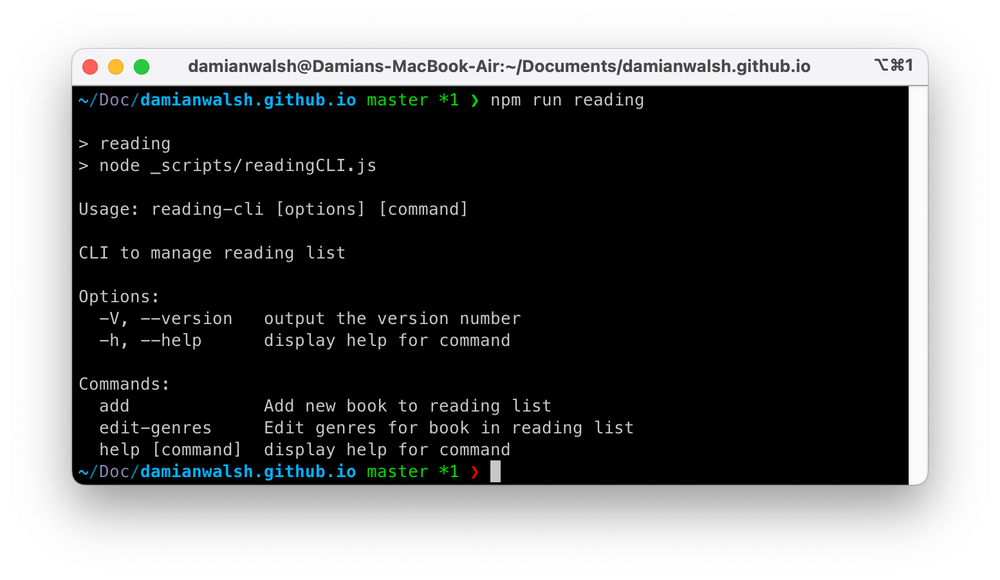


.screenshots {
  display: flex;
  flex-direction: column;
  gap: var(--flow-space);
  padding-inline: calc((100% - 75%) / 2);
  @media screen and (width >= 769px) {
    flex-direction: row;
  }
  &.no-pad {
    padding-inline: 0;
  }
}

Building on my experience creating a [digital music library with Eleventy and APIs](https://damianwalsh.co.uk/posts/creating-connections-with-music-and-technology/), I wanted to apply similar principles and lessons learned to organise my book collection. Creating a digital bookshelf with a static site generator isn't particularly new or original. Many similar projects and write-ups already exist. This one simply documents my personal approach.

## The OpenLibrary API
Several providers offer programmatic access to retrieve information and help organise a personal book library. I selected [OpenLibrary](https://openlibrary.org/developers/api) because its ethos aligns with one of my overarching principles for this project: using services that strike a balance between public good and commercial interests. OpenLibrary offers a range of APIs, including the [My Books API](https://openlibrary.org/dev/docs/api/mybooks), which could essentially be used as a CMS, and the [Books API](https://openlibrary.org/dev/docs/api/books), which I use to retrieve information.

### Editions vs Works
OpenLibrary organises books in two main ways: Editions and Works. When you consider the book you're currently reading, you're most likely thinking about a specific Edition. Works, on the other hand, are collections of related Editions—including translations, previous versions, and various formats. Works contain general information about a book, while Editions include specific details like publisher and [International Standard Book Number (ISBN)](https://en.wikipedia.org/wiki/ISBN).

Both Work and Edition pages on OpenLibrary can be accessed as JSON by simply changing the page URL. To illustrate the difference in data returned by the API, I'll use one of my favourite books as an example: [The Secret History by Donna Tartt](https://damianwalsh.co.uk/reading/works/the-secret-history-donna-tartt/).

**Edition:** [openlibrary.org/books/OL38246222M.json](https://openlibrary.org/books/OL38246222M.json)

**Work:** [openlibrary.org/works/OL4321141W.json](https://openlibrary.org/works/OL4321141W.json)

Using the Work ID instead of the Edition ID can occasionally produce unexpected results—such as returning a description in a language other than English. Despite this, I prefer using the Work ID to retrieve information and linking to this record on OpenLibrary. This way, if a visitor to my website discovers a book they want to read, they can more easily find an edition that suits their needs—whether that's format (audiobook, ebook, print), language, or how they get hold of it. I appreciate that OpenLibrary provides links to find libraries where a book can be borrowed or shops selling used books. It's more inclusive—this benefit outweighs any potential drawbacks.

## Creating a library catalogue
Like my music collection, I organise my books using [principles traditionally used in libraries](https://en.wikipedia.org/wiki/Library_catalog) within a [Global Data File](https://www.11ty.dev/docs/data-global/). Each entry acts as an index card, with the OpenLibrary ID functioning as its call number.

```json
{
  "title": "The Secret History",
  "author": "Donna Tartt",
  "openlibrary_key": "OL4321141W",
  "date_read": "2018-11-08",
  "favourite": true,
  "genres": [
    "Fiction"
  ]
},
```
One drawback of using community-driven sources of information is that the responses from the API may not always match your own personal preferences. I wanted to organise my book collection using a familiar set of categories, so I add my own genres instead of using subjects returned by the OpenLibrary API. This highlights one of the key benefits of personal websites and the flexibility that tools like Eleventy provide to organise and arrange content in ways that match your own way of thinking.

## Enriching book data
To enrich raw data with additional details from OpenLibrary, I create a script that uses [Eleventy Fetch](https://www.11ty.dev/docs/plugins/fetch/) to handle API requests. The script processes each book in my collection, using the OpenLibrary ID to fetch additional details and create an enriched version used in my Collections.

```js
import "dotenv/config";
import EleventyFetch from "@11ty/eleventy-fetch";
import { promises as fs } from "fs";

const OPENLIBRARY_USER_AGENT = process.env.USER_AGENT;

async function fetchOpenLibraryData(url) {
  return EleventyFetch(url, {
    duration: "1y",
    type: "json",
    fetchOptions: {
      headers: {
        "User-Agent": OPENLIBRARY_USER_AGENT,
        "Accept": "application/json",
      },
    },
  });
}

const delay = (ms) => new Promise((resolve) => setTimeout(resolve, ms));

async function fetchBookDetails(book) {
  if (!book.openlibrary_key) {
    console.error("No OpenLibrary ID provided for book:", book.title);
    return book;
  }
  const url = `https://openlibrary.org/works/${book.openlibrary_key}.json`;
  try {
    const bookDetails = await fetchOpenLibraryData(url);
    await delay(1000);
    return {
      ...book,
      first_publish_date: bookDetails.first_publish_date,
      description:
        typeof bookDetails.description === "object"
          ? bookDetails.description.value || ""
          : bookDetails.description || "",
    };
  } catch (error) {
    console.error(`Error fetching details for ${book.title}:`, error);
    return book;
  }
}

async function enrichReadingList() {
  try {
    const localData = await fs.readFile("_data/reading.json", "utf8");
    const myBooks = JSON.parse(localData);
    const enrichedBooks = await Promise.all(myBooks.map(fetchBookDetails));
    await fs.writeFile(
      "_data/enriched/reading.json",
      JSON.stringify({ current: enrichedBooks }, null, 2)
    );
    console.log(`Successfully enriched ${enrichedBooks.length} books.`);
  } catch (error) {
    console.error("Error processing book list:", error);
  }
}

if (process.argv[1].endsWith("enrichReading.js")) {
  enrichReadingList();
}

export { enrichReadingList };
```

## Organising books with Collections
The [Collections API](https://www.11ty.dev/docs/collections-api/) can be used to access and organise data. I use it to arrange my enriched book data in several ways—sorting by author surname, genre, or reading date. For example, my genre collection configuration creates an array of genre objects, each containing the genre name and all books belonging to that genre. Books tagged with multiple genres appear across different genre groups. Any books without genres are assigned to an "Uncategorised" group.

```js
eleventyConfig.addCollection("booksByGenre", function (collectionApi) {
    const enrichedReading = require("./_data/enriched/reading.json");
    const books = enrichedReading.current;
    const genres = [];
    const booksByGenre = {};

    books.forEach(book => {
      if (book.genres && book.genres.length > 0) {
        book.genres.forEach(genre => {
          if (!booksByGenre[genre]) {
            booksByGenre[genre] = [];
          }
          booksByGenre[genre].push(book);
        });
      } else {
        if (!booksByGenre["Uncategorised"]) {
          booksByGenre["Uncategorised"] = [];
        }
        booksByGenre["Uncategorised"].push(book);
      }
    });

    Object.keys(booksByGenre)
      .sort()
      .forEach(genre => {
        genres.push({
          genre: genre,
          books: booksByGenre[genre]
        });
      });

    return genres;
  });
  ```

## Creating pages from data
Taking genres as an example, individual pages for each Collection are automatically generated using [pagination](https://www.11ty.dev/docs/pagination/) to create multiple files from a single [Nunjucks](https://mozilla.github.io/nunjucks/) template. The following example shows the [YAML](https://yaml.org/) front matter that generates individual genre pages.

```yaml
---
eleventyNavigation:
  key: "reading-genre-{{ genreData.genre }}"
  title: "{{ genreData.genre }}"
  parent: reading-genres
eleventyComputed:
  title: "{{ genreData.genre }} | Reading"
pagination:
  data: collections.booksByGenre
  size: 1
  alias: genreData
permalink: "/reading/genres/{{ genreData.genre | slugify }}/"
--- 
```

## Managing data with a CLI
To simplify the process of adding and editing book data, I built a simple [command-line tool](https://github.com/damianwalsh/damianwalsh.github.io/blob/master/_scripts/readingCLI.js) using [Commander](https://www.npmjs.com/package/commander) and [Inquirer](https://www.npmjs.com/package/inquirer), eliminating the need to manually edit JSON files or run separate scripts for tasks. The current CLI includes functions which take care of:

**Adding new books**

- Add required details (title, author, OpenLibrary ID)
- Record date read
- Mark if the book is a favourite
- Assign genres from a predefined list via a multi-select interface
- Resize images using [ImageMagick](https://imagemagick.org/) and create filenames with [URL slugs](https://www.npmjs.com/package/@sindresorhus/slugify) that match those used in templates (e.g., `the-secret-history-donna-tartt.jpg`)
- Enrich with additional data from the OpenLibrary API

**Editing genres for existing books**

- Select books from list sorted alphabetically by author and title
- Add or remove genres using a multi-select interface
- Update the raw and enriched data files

The entire workflow is simplified to a single command—`npm run reading` followed by interactive prompts.

<figure>
  <div class="screenshots">
    
  </div>
  <figcaption class="meta">Command-line interface for book collection</figcaption>
</figure>

## Digital bookshelf
Now I can browse my website to find [books I've read](https://damianwalsh.co.uk/reading/) in one place—rather than searching across various platforms or digging through stacks of printed books. I can sort my collection by [author](https://damianwalsh.co.uk/reading/authors/), [genre](https://damianwalsh.co.uk/reading/genres/), or [year read](https://damianwalsh.co.uk/reading/years/), and easily identify my [favourites](https://damianwalsh.co.uk/reading/favourites/).

<figure>
  <div class="screenshots no-pad">
    
  </div>
  <figcaption class="meta">Templates rendered by Eleventy</figcaption>
</figure>

## Retrospective
As I discovered with my music collection project, having the courage to build something—anything—and publish it often triggers a wave of new ideas. The difference between the two projects is how quickly they came together. This underlined an important lesson for me after a fairly dispiriting period in my professional life: when you focus on building proficiency, speed follows; focusing on speed alone won't make you faster.
