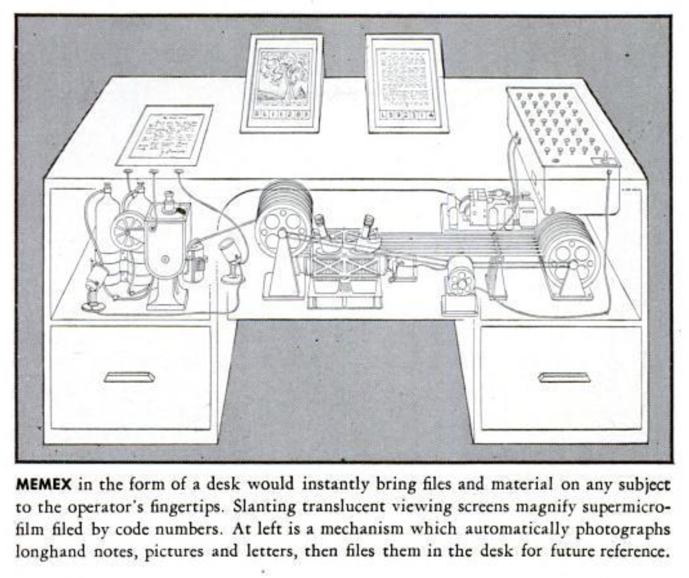
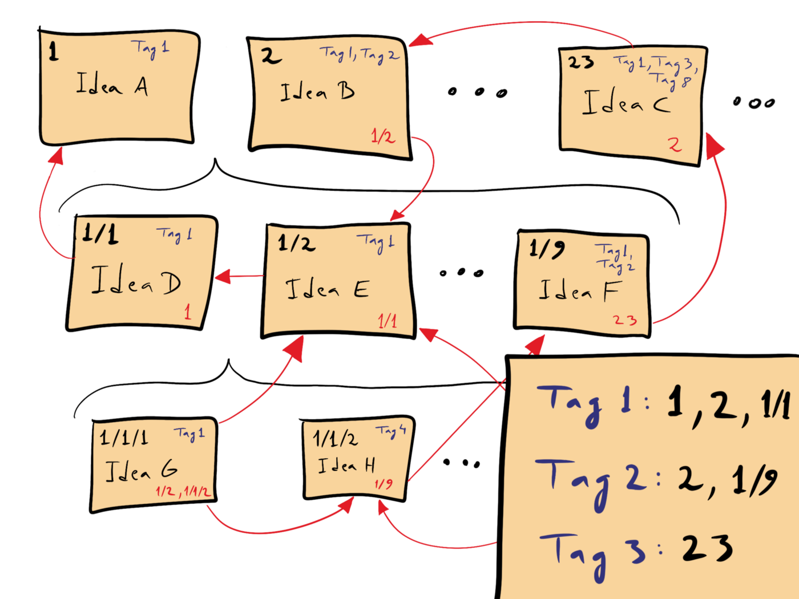


.screenshots {
  display: flex;
  flex-direction: column;
  gap: var(--flow-space);
  padding-inline: calc((100% - 75%) / 2);
  @media screen and (width >= 769px) {
    flex-direction: row;
  }
}
table {
  display: block;
  overflow-x: auto;
}


Back in December 2024, while I was doing the usual end-of-year contemplation, [Spotify's annual Wrapped](https://newsroom.spotify.com/2024-wrapped/) feature arrived, ringing a bell in my mind. I realised my scattershot listening habits on Spotify and the snapshot Wrapped presents failed to capture my changing tastes over time or evoke feelings and memories in the same way as a tangible music collection. Music is a fundamental part of my life—I've always been a fan. My earliest memories are rooted in music, exploring my parents' vinyl collection and watching [Top of the Pops](https://en.wikipedia.org/wiki/Top_of_the_Pops), fascinated by the sounds and imagery. And later, making the rounds of record shops, building my collection, and plastering my teenage bedroom walls with band artwork, portraits, and memorabilia. In a funny sort of way, music was my gateway into design.

<figure>
  <div class="screenshots video__wrapper">
    
    <iframe
      class="youtube__player "
      src="https://www.youtube.com/embed/bDMCwSP5nf0?enablejsapi=1&autoplay=1&mute=1"
      title="YouTube video player"
      frameborder="0"
      allow="accelerometer; autoplay; clipboard-write; encrypted-media; gyroscope"
    ></iframe>
    <button class="video__play action" aria-label="Play video"><svg viewBox="-6 -6 36 36" width="36" height="36"
    class="icon-stroke" aria-hidden="true"><use xlink:href="#icon-play"></use></svg></button>
  </div>
  <figcaption class="meta">Always on My Mind by Pet Shop Boys</figcaption>
</figure>

At the same time I was thinking about this, I was also feeling generally uninspired about the tech industry’s current direction and its impact on the world—especially compared to earlier visions of the internet. I want to direct my online thinking and doing toward something *I believe in.* My music collection seemed to be one of the areas I could meaningfully apply technology to connect with something I'm passionate about and learn something new in the process. I've previously written about [cultivating a digital garden](https://damianwalsh.co.uk/posts/cultivating-a-digital-garden/) to achieve these aims. One of the concepts I came across while researching the idea was the [Memex](https://en.wikipedia.org/wiki/Memex), proposed by [Vannevar Bush](https://en.wikipedia.org/wiki/Vannevar_Bush) in his 1945 article [As We May Think](https://archive.org/details/as-we-may-think).

<figure>
  <div class="screenshots">
    
  </div>
  <figcaption class="meta">Theoretical Memex (memory index) device</figcaption>
</figure>

Bush envisioned a device that would act as a personal knowledge repository, capable of storing and organising books, records, and other information while automatically creating connections between them—essentially serving as a personalised library system. This concept seemed useful for applying to one of the challenges with physical media collections like [music](https://damianwalsh.co.uk/music-collection/) and [books](https://damianwalsh.co.uk/reading-list/): as collections grow larger, they become increasingly difficult to organise, navigate, and use to retrieve the ideas and emotions contained within them.

## Eleventy
To turn this concept into a working application that would help me reconnect with my music collection, I turned to [Eleventy](https://www.11ty.dev/), a static site generator. I had a basic working knowledge of Eleventy before developing the latest iteration of this website in January 2025—learning more was the motivating factor in choosing it. Fortunately, it turned out to be well-suited to this type of task and has an active, supportive community around it.

The rest of this document outlines my approach, decisions made along the way, challenges encountered and solutions found, including some code examples. Rather than a technical how-to guide, think of it as a living document of release notes tracking the progress and evolution of ideas.

## Version 1: Proof of concept
<time class="meta" datetime="2025-01">January 2025</time>

So, in summary, here's where I stood at the outset: Spotify Wrapped galvanised me into action and Bush's Memex concept signposted the direction I wanted to move in.

<figure>
  <div class="screenshots">
    
  </div>
  <figcaption class="meta">My music collection</figcaption>
</figure>

__Things I know:__
- I have approximately 500 records—CDs from 1991–2015 and vinyl from 2017–present—that I want to organise meaningfully. I don't have purchase dates for most of the collection.
- I want to build my own system, incorporating automation using tools and services that align with [my values](https://damianwalsh.co.uk/colophon), learning something through the process.

__Assumptions:__
- APIs can provide the data and be used to create the automated connections needed for a personalised library system.
- I can master Eleventy sufficiently to make it serve my needs.

### Library classification
Libraries employ [classification systems](https://en.wikipedia.org/wiki/Library_classification) to organise materials on shelves and in catalogues and indexes. Each item gets a call number indicating its location within the system. In record shops, you encounter a [faceted classification](https://en.wikipedia.org/wiki/Faceted_classification) system that separates vinyl from CDs and organises records by genre (like Rock and Pop), then sorts them alphabetically by artist.

<figure>
  <div class="screenshots">
    
    
  </div>
  <figcaption class="meta">Library classification systems</figcaption>
</figure>

The record industry uses its own system of identifiers called ISRC (International Standard Recording Code), but these aren't readily accessible. Instead, barcodes and label catalogue numbers printed on sleeves and discs—which identify specific versions of releases—can be used to connect physical collections with APIs and create a digital library organised similarly to record shops.

### API comparison
There are a range of APIs that provide metadata to help organise and catalogue a library of music releases. The question is which one to choose. I picked several and tried to compare the relative benefits of each:

|  | [Discogs](https://www.discogs.com/developers) | [MusicBrainz](https://musicbrainz.org/doc/MusicBrainz_API) | [Spotify](https://developer.spotify.com/documentation/web-api) |
| --- | --- | --- | --- |
| __Physical media focus__ | Excellent | Good | Limited |
| __Data completeness__ | Extensive physical release data, high accuracy for vinyl/CD | High for basic metadata, community-maintained | Comprehensive for streaming content, limited physical media data |
| __API rate limits__ | 60 requests/minute authenticated | 1 request/sec for anonymous, 4/sec authenticated | Several tiers based on API quota |
| __Community contribution__ | Moderated submissions | Open editing | Closed system |
| __Cost__ | Free for non-commercial use | Free, open source | Free tier available |

Discogs appears to best fit my needs and aligns with one of my overarching principles for this project: using services that strike a balance between public good and commercial interests.

### Selecting metadata
Taking one of my favourite records as an example: Brian Eno's [Another Green World](https://damianwalsh.co.uk/music-collection/releases/another-green-world-brian-eno-vinyl). Using the barcode printed on the sleeve (0602557703887), I can search [Discogs](https://www.discogs.com/) and see the resulting [URL](https://www.discogs.com/release/11176407-Eno-Another-Green-World) reveals its release ID (11176407). With this ID, I can fetch information about this specific release at the command line:

```bash
curl https://api.discogs.com/releases/11176407 --user-agent "FooBarApp/3.0"
```

The API returns a wealth of information in JSON format. From this data, I can cherry-pick the essential key/value pairs to display and organise releases in my collection according to format, genre, release year, and artist. Here's a simplified version of the response showing these fields:

```json
{
    "year": 2017,
    "uri": "https://www.discogs.com/release/11176407-Eno-Another-Green-World",
    "formats": [
        {
            "name": "Vinyl",
            "descriptions": [
                "LP",
                "Album",
                "Reissue",
                "Remastered"
            ],
            "text": "180 gram"
        }
    ],
    "videos": [
        {
            "uri": "https://www.youtube.com/watch?v=bNwhtnaoVZU"
        }
    ],
    "genres": [
        "Electronic"
    ],
    "tracklist": [
        {
            "position": "A1",
            "title": "Sky Saw",
            "duration": "3:25"
        }
    ]
}
```

### Release dates
Release dates are a bit of a minefield. While they reliably follow the [ISO 8601](https://en.wikipedia.org/wiki/ISO_8601) format (YYYY-MM-DD), entries can contain partial dates (YYYY or YYYY-MM), and release dates vary between regions like the US and UK. Since my vinyl collection consists mainly of reissues, the dates returned by the API reflect when the reissue was published rather than original release dates. Some degree of imprecision doesn't bother me—this isn't meant to be an encyclopedia. What matters most is having at least the _original_ release year—it allows me to access personal memories by consulting my library and playing records from specific years.

### Global Data Files
Before the internet, online databases, and standardised cataloguing protocols, libraries relied on a physical [library catalogue](https://en.wikipedia.org/wiki/Library_catalog) system. This used [index cards](https://en.wikipedia.org/wiki/Index_card) to record key details about each item, making it easy to find and retrieve materials. Following this principle, I use a [Global Data File](https://www.11ty.dev/docs/data-global/) to organise my collection—each entry functions like an index card, with the release ID serving as its call number.

```js
{
  "artist": "Brian Eno",
  "title": "Another Green World",
  "format": "Vinyl",
  "release_id": 11176407,
  "first_released": "1975-11-14",
  "favourite": true
},
```

In a separate Global Data File, I configure the [Fetch plugin](https://www.11ty.dev/docs/plugins/fetch/) to manage data requests. The plugin caches data locally to avoid bombarding the API with requests for assets including JSON, HTML, images, videos, etc. Walking through the code, here's how I fetch data from the Discogs API:

- Import Node packages to manage environment variables, handle API requests, and perform asynchronous file operations
- Set up Discogs API token and user agent from environment variables for authentication

```js
import "dotenv/config";
import EleventyFetch from "@11ty/eleventy-fetch";
import { promises as fs } from 'fs';
const DISCOGS_TOKEN = process.env.DISCOGS_TOKEN;
const DISCOGS_USER_AGENT = process.env.USER_AGENT;
```

Firstly, add a 1-second delay between API calls to respect Discogs' rate limits, and cache responses locally for 24 hours.

```js
const delay = ms => new Promise(resolve => setTimeout(resolve, ms));
async function fetchWithRateLimit(url) {
  await delay(1000);
  return EleventyFetch(url, {
    duration: "1d",
    type: "json",
    fetchOptions: {
      headers: {
        'Authorization': `Discogs token=${DISCOGS_TOKEN}`,
        'User-Agent': DISCOGS_USER_AGENT,
      },
    }
  });
}
```

Next, read the library catalogue, which contains index cards with details about each item.

```js
export default async function () {
  try {
    const localData = await fs.readFile('_data/musicCollection.json', 'utf8');
    const myCollection = JSON.parse(localData);
    const releases = await Promise.all(myCollection.map(fetchReleaseDetails));
    return { releases };
  } catch (error) {
    console.error('Error processing music collection:', error);
    return { releases: [] };
  }
}
```

Finally, details are fetched from the Discogs API using the release IDs, transforming everything into a consistent format that can be used in collections and templates.

```js
async function fetchReleaseDetails(release) {
  if (!release.release_id) {
    console.error('No Discogs ID provided for release:', release.title);
    return release;
  }
  const releaseUrl = `https://api.discogs.com/releases/${release.release_id}`;
  try {
    const releaseDetails = await fetchWithRateLimit(releaseUrl);
    const uniqueFormats = new Set();
    return {
      ...release,
      year: releaseDetails.year,
      notes: releaseDetails.notes,
      released: releaseDetails.released,
      genres: releaseDetails.genres || [],
      uri: releaseDetails.uri,
      videos: releaseDetails.videos?.map(video => ({
        url: video.uri,
      })) || [],
      formats: (releaseDetails.formats || []).reduce((acc, format) => {
        if (!uniqueFormats.has(format.name)) {
          uniqueFormats.add(format.name);
          acc.push({
            name: format.name,
            descriptions: format.descriptions
          });
        }
        return acc;
      }, []),
      tracklist: (releaseDetails.tracklist || []).map(track => ({
        position: track.position,
        title: track.title,
        duration: track.duration
      }))
    };
  } catch (error) {
    console.error(`Error fetching details for ${release.title}:`, error);
    return release;
  }
}
```

### Collections
The [Collections API](https://www.11ty.dev/docs/collections-api/) can be used to access and organise data. I use this feature to organise my music library in a variety of ways: grouping releases by artist, sorting by genre and format, organising by release year and creating related content connections. Collections are powerful because they let you transform and arrange content in ways that suit your specific needs.

For example, this collection organises music releases by year, handling various date formats and categorising releases by year. The `parseDate` function handles three date formats: year only (YYYY), year and month (YYYY-MM), and complete date (YYYY-MM-DD). When dates are incomplete, it defaults to the first day of the month or year.

```js
const parseDate = (dateStr) => {
  if (!dateStr) return null;

  const parts = dateStr.split('-');
  // If only year is provided
  if (parts.length === 1) {
    return new Date(parts[0], 0, 1);
  }
  // If year and month are provided
  if (parts.length === 2) {
    return new Date(parts[0], parts[1] - 1, 1);
  }
  // If complete date is provided
  return new Date(parts[0], parts[1] - 1, parts[2]);
};
```

The `releaseYears` collection performs several tasks: it extracts years from the music data, prioritising first released date, removes duplicates, sorts chronologically, and groups releases by year.

```js
eleventyConfig.addCollection("releaseYears", function (collectionApi) {
  const musicData = collectionApi.getAll()[0]?.data?.music;
  if (!musicData || !musicData.releases) {
    console.warn("Music data not found or invalid");
    return [];
  }

  const years = [...new Set(musicData.releases
    .map(release => {
      // Prefer first_released if available, otherwise use released
      const date = parseDate(release.first_released) || parseDate(release.released);
      return date ? date.getFullYear() : null;
    })
    .filter(year => year !== null)
  )].sort((a, b) => a - b);

  return years.map(year => ({
    year,
    releases: musicData.releases.filter(r => {
      // Prefer first_released if available, otherwise use released
      const date = parseDate(r.first_released) || parseDate(r.released);
      return date && date.getFullYear() === year;
    })
  }));
});
```

### Filters
Eleventy provides built-in [Filters](https://www.11ty.dev/docs/filters/) to transform data within templates, you can also create custom filters. Here's a simple filter with a modest task—extracting just the year from a date string. I use it to create links to relevant year pages from within individual release pages.

```js
eleventyConfig.addFilter("extractYear", (dateString) => {
  if (!dateString) return "";
  const parts = dateString.split('-');
  return parts[0];
});
```

### Creating pages from data
Individual pages for artists, formats, genres, years, and releases are automatically generated using [pagination](https://www.11ty.dev/docs/pagination/) to create multiple files from a single [Nunjucks](https://mozilla.github.io/nunjucks/) template. The following example shows the [YAML](https://yaml.org/) front matter that generates individual release pages for each entry in my library.

```yaml
---
eleventyNavigation:
  key: "{{ release.title }}"
  parent: Releases
eleventyComputed:
  title: "{{ release.title }} - {{ release.artist }} | Music Collection"
pagination:
  data: collections.releases
  size: 1
  alias: release
permalink: "/music-collection/releases/{{ release.title | slugify }}-{{ release.artist | slugify }}-{{ release.format | slugify }}.html"
--- 
```

And from within the template itself, filters are applied to collection data to format dates and generate links to relevant artist, year, format, and genre index pages.

```html
<dl class="detail__meta">
  <dt>Artist</dt>
  <dd><a href="/music-collection/artists/{{ release.artist | slugify }}.html">{{ release.artist }}</a></dd>
  
  <dt>Release date</dt>
  <dd>
  
  
  {{ release.released | readableDate }} (first released: <a href="/music-collection/years/{{ release.first_released | extractYear }}.html">{{ release.first_released | readableDate }}</a>)
  
  <a href="/music-collection/years/{{ release.released | extractYear }}.html">{{ release.released | readableDate }}</a>
  
  
  <a href="/music-collection/years/{{ release.first_released | extractYear }}.html">{{ release.first_released | readableDate }}</a>
  
  </dd>
  
  <dt>Format</dt>
  <dd>
    <a href="/music-collection/formats/{{ release.format | slugify }}.html">{{ release.format }}</a>
    
    
    ({{ format.descriptions | join(", ") }})
    
    
  </dd>
  
  <dt>Genres</dt>
  <dd>
    <a href="/music-collection/genres/{{ genre | slugify }}.html">{{ genre }}</a>, 
    
  </dd>
  
</dl>

```

### Images
Image quality from community-driven APIs like Discogs varies. What constitutes acceptable is subjective and personal. For me, the artwork is as intimately linked to my thoughts and feelings as the music itself. Using Another Green World as an example—you can see the primary image provided by the API displayed alongside the one I chose for my library. I've downloaded and hosted the API's image locally rather than hotlinking to it, since their version could change.

<figure>
  <div class="screenshots">
    
    
  </div>
  <figcaption class="meta">Image quality comparison: API vs personal choice</figcaption>
</figure>

The API's version is marred by a sticker and, on closer inspection, has a distracting reflection on the cover. To take control over quality, I select and process my own images using [ImageMagick](https://imagemagick.org/) installed with [Homebrew](https://brew.sh/). Within templates, I use the Eleventy [Image](https://www.11ty.dev/docs/plugins/image/) plugin to automatically optimise images and the built-in [slugify](https://www.11ty.dev/docs/filters/slugify/) filter to construct paths to images.

### Data cascade
In Eleventy, data from multiple sources merges through a process called the [Data Cascade](https://www.11ty.dev/docs/data-cascade/) before templates are rendered. Using the library metaphor, Eleventy acts as a librarian—it consults the global data files (library catalogue) and uses the release ID (call number) to fetch data from the API, organise everything, and render templates when I run `npx @11ty/eleventy` at the command line. All this happens quickly, as Eleventy's report after building my site demonstrates: `Wrote 1,310 files in 43.67 seconds (33.3ms each, v3.0.0)`.

<figure>
  <div class="screenshots">
    
  </div>
  <figcaption class="meta">Templates rendered by Eleventy</figcaption>
</figure>

### Retrospective
What have I learned? The concepts borrowed from Bush and libraries are worth pursuing—technology can be used to breathe new life into classic ideas.

The learning and development process has been enjoyable, rather than just a means to an end. Eleventy feels almost magical—there's no need for databases or complex frameworks. Instead, I can work with familiar web technologies (HTML, CSS & JS) and closely related concepts and tools.

If I can use Eleventy to build a time machine—unlocking personal memories and feelings by revisiting any specific [format](https://damianwalsh.co.uk/music-collection/formats/vinyl), [genre](https://damianwalsh.co.uk/music-collection/genres/rock), [year](https://damianwalsh.co.uk/music-collection/years/1994), or [artist](https://damianwalsh.co.uk/music-collection/artists/david-bowie) in my library and playing these records—I wonder what else I can build?

The proof of concept has triggered new ideas that provide momentum to continue development, including:

- Enriching API data with personal touches: highlighting standout tracks, tracking favourites over time, and adding personal reviews and memories connected to specific times, places, people, and events
- Enhancing views with data visualisations (think [Information is Beautiful](https://informationisbeautiful.net/))
- Improving data requests and error handling
- Refining image processing workflows
- Adding search functionality

Looking back at my original motivation—disenchantment with streaming services and the tech industry's current trajectory—and comparing it to my experiences with this project brings to mind diving. Given the choice between diving into a stream or an ocean, who wouldn't choose the ocean?

<figure>
  <div class="screenshots">
    
  </div>
  <figcaption class="meta">Image from inside cover of <a href="https://damianwalsh.co.uk/music-collection/releases/wish-you-were-here-pink-floyd-vinyl">Wish You Were Here</a> <br>© Pink Floyd Music</figcaption>
</figure>

## Version 2: Memory boxes
<time class="meta" datetime="2025-02">February 2025</time>

After reflecting on ideas generated during the [proof-of-concept](#version-1%3A-proof-of-concept) development, I faced a choice: pursue the idea of enhancing views with data visualisations—an appealing design direction—or focus on something more personally meaningful. I was already well aware of music's connection to memory, but was still surprised by the wave of memories and feelings that emerged when I organised my collection chronologically. Instead of adopting streaming platforms' one-size-fits-all organisational approach, I want to create personal pathways linking music to memory. I chose to follow the trail of ideas leading from enriching API data with memories connected to specific times, places, people, and events. This direction seemed more aligned with Bush's vision: creating a personal memory extension that, in this context, connects music to life experiences.

<figure>
  <div class="screenshots">
    
  </div>
  <figcaption class="meta">Building connections between music, memory and emotion</figcaption>
</figure>

**Things I know:**

My initial assumptions about APIs and Eleventy—that they could provide the data and create the automated connections needed for a personalised library system—have now been confirmed.

**Assumptions:**

Building on lessons learned developing the proof of concept, I can create trails of reference that link my music collection with memories.

### The working model of memory
The [Working Memory Model](https://en.wikipedia.org/wiki/Baddeley%27s_model_of_working_memory), first proposed by Baddeley and Hitch in 1974 and updated in 2001, describes how the brain processes visual and auditory information. In this model, different compartments—the phonological loop, visuo-spatial sketchpad, episodic buffer, and central executive—each handle different aspects of processing. New information is initially stored in short-term memory before being related to long-term memory. Understanding this model (at a _basic_ level) casts light on how visual and spatial cues might be used alongside music to unlock memories and feelings—triggering the episodic buffer, which integrates sounds, visuals, and long-term memories into brief, temporal experiences.

<figure>
  <div class="screenshots">
    
  </div>
  <figcaption class="meta">The Working Memory Model. Baddeley and Hitch (1974, 2001)</figcaption>
</figure>

### Zettelkasten
One of the concepts I came across while researching how to practically apply this idea to connect my music collection with people, places, and events was [Zettelkasten](https://en.wikipedia.org/wiki/Zettelkasten)—which, in addition to being a word that sounds good enough to eat—is a method of [note-taking](https://en.wikipedia.org/wiki/Note-taking) and [personal knowledge management](https://en.wikipedia.org/wiki/Personal_knowledge_management) used for research, study, and writing. This system was also the original inspiration for the [invention of wikis](https://en.wikipedia.org/wiki/History_of_wikis).

<figure>
  <div class="screenshots">
    
  </div>
  <figcaption class="meta">Zettelkasten knowledge management system. <br>Image by David B. Clear, licensed under <a href="https://creativecommons.org/licenses/by-sa/4.0/" rel="license">CC BY-SA 4.0</a></figcaption>
</figure>

I use this method to extend my music collection's data structure by creating additional [Global Data Files](https://www.11ty.dev/docs/data-global/) to include people, places, and events.

**people.json**

```json
 "steve-s": {
    "name": "Steve",
    "relationship": "University friend"
  }
```

**places.json**

```json
"university": {
    "location": "University of Plymouth (Exeter College of Art and Design)",
    "coordinates": {
      "lat": 50.7099,
      "lng": -3.5135
    }
  }
```

**musicCollection.json**

```json
 {
    "artist": "Supergrass",
    "title": "I Should Coco",
    "format": "CD",
    "release_id": 4147466,
    "favourite": false,
    "memories": {
      "people": [
        "steve-s",
        "alastair-j"
      ],
      "places": [
        "university"
      ]
    }
  },
```

This structure prevents duplicating person and place data across multiple entries in the main data file. Instead, it allows any number of people, places, or events to be linked using ID arrays, while making all the data accessible to templates through the [Configuration](https://www.11ty.dev/docs/config/) file in the root directory.

```js
export default async function (eleventyConfig) {

  const peopleData = require('./_data/people.json');
  eleventyConfig.addGlobalData("people", () => peopleData);

  const placesData = require('./_data/places.json');
  eleventyConfig.addGlobalData("places", () => placesData);
}
```

With this basic setup, I can display people, places, and events connected to specific releases on templates. As I discovered earlier, [Filters](#filters) can handle simple transformations, but more interestingly, they can also be used to create pathways to other releases that share the same people, places, and events.

```js
eleventyConfig.addFilter("releasesWithMemoryConnections", function(allReleases, currentRelease) {
  if (!currentRelease.memories) return [];

  // Get the release's memories
  const currentPeople = new Set(currentRelease.memories.people || []);
  const currentPlaces = new Set(currentRelease.memories.places || []);

  // Filter releases that share people or places, excluding the current release
  const relatedReleases = allReleases.filter(release => {
    if (release.release_id === currentRelease.release_id) return false;
    if (!release.memories) return false;

    // Check for shared people
    const sharedPeople = release.memories.people?.some(person =>
      currentPeople.has(person)
    );

    // Check for shared places
    const sharedPlaces = release.memories.places?.some(place =>
      currentPlaces.has(place)
    );

    return sharedPeople || sharedPlaces;
  });

  // Sort by artist, then title
  return relatedReleases.sort((a, b) => {
    const artistCompare = a.artist.localeCompare(b.artist);
    if (artistCompare !== 0) return artistCompare;
    return a.title.localeCompare(b.title);
  });
});
```

### Maps
[Spatial memory](https://en.wikipedia.org/wiki/Spatial_memory), the visuo-spatial sketchpad in Baddeley and Hitch's model, plays a role in how we process and recall experiences. [Cognitive maps](https://en.wikipedia.org/wiki/Cognitive_map)—complex networks of spatial relationships between landmarks, paths, and distances—help us navigate both physical spaces and through memory. I wanted to harness this natural connection between location and memory by incorporating maps into the memory box feature.

I evaluated several map providers that offer programmatic access, comparing their benefits and drawbacks against my requirements and values:

| **Provider** | **Pros** | **Cons** |
| --- | --- | --- |
| [Leaflet](https://leafletjs.com/) + [OpenStreetMap](https://www.openstreetmap.org/) | Full interactivity possible, open source | More complex setup - managing tile servers etc. |
| [Mapbox](https://www.mapbox.com/) | Simple implementation, generous free tier (50,000 map loads/month) | Credit card details required to access API key |

Although Leaflet appeared to offer more customisation options and is fully open source, I chose Mapbox because it seemed easier for me to implement and suits my current needs for static maps with location markers while leaving the door open for adding interactive features later.

First, I configure the [Fetch plugin](https://www.11ty.dev/docs/plugins/fetch/) in a separate [Global Data File](https://www.11ty.dev/docs/data-global/) to manage requests for static map graphics from the [Mapbox API](https://docs.mapbox.com/api/overview/). The code places markers at specified coordinates and creates map URLs for both single and multiple locations. By caching the map images, I avoid unnecessary API requests and minimise potential costs—though exceeding the free tier limit is unlikely given my collection size and map requirements.

```js
import EleventyFetch from "@11ty/eleventy-fetch";

export async function generateStaticMap(places, mapboxToken) {
  // Filter out places without coordinates
  const markers = places.filter(place => place.coordinates);
  if (markers.length === 0) return null;

  const width = 800;
  const height = 400;

  // Create marker overlay string
  const markerString = markers
    .map(place => `pin-s+FF0000(${place.coordinates.lng},${place.coordinates.lat})`)
    .join(',');

  let mapUrl;
  if (markers.length === 1) {
    // Single marker - use center and zoom
    const marker = markers[0];
    mapUrl = `https://api.mapbox.com/styles/v1/mapbox/streets-v11/static/${markerString}/${marker.coordinates.lng},${marker.coordinates.lat},12/${width}x${height}?access_token=${mapboxToken}`;
  } else {
    // Multiple markers - use auto
    mapUrl = `https://api.mapbox.com/styles/v1/mapbox/streets-v11/static/${markerString}/auto/${width}x${height}?padding=50&access_token=${mapboxToken}`;
  }

  try {
    const imageBuffer = await EleventyFetch(mapUrl, {
      duration: "1d",
      type: "buffer"
    });
    return { imageBuffer, width, height };
  } catch (error) {
    console.error("Error generating map:", error);
    return null;
  }
}
```

Then, a [Shortcode](https://www.11ty.dev/docs/shortcodes/) in my configuration makes the function available in templates to generate a map for the places associated with the release.

```js
import { generateStaticMap } from './_data/maps.js';

export default async function (eleventyConfig) {
  eleventyConfig.addShortcode("memoryMap", async function (places) {
    const mapboxToken = process.env.MAPBOX_TOKEN;
    if (!mapboxToken) {
      console.warn("No Mapbox token found");
      return "";
    }

    const mapData = await generateStaticMap(places, mapboxToken);
    if (!mapData) {
      return "";
    }

    // Return map HTML with base64 encoded image
    const base64Image = mapData.imageBuffer.toString('base64');
    return ``;
  });
};
```
### Release template
Finally, on the actual release pages, the visual design draws inspiration from diagrams of both Baddeley and Hitch's Working Memory Model and the Zettelkasten concept. The layouts flexibly adapt to different screen sizes and memory content. When I browse my library now, each release page functions as a personalised record sleeve, offering cues that help trigger memories as I play the music.

Examples of release pages with memory box feature:

- [Orbital - Orbital](https://damianwalsh.co.uk/music-collection/releases/orbital-orbital-cd.html)
- [Stanley Road - Paul Weller](https://damianwalsh.co.uk/music-collection/releases/stanley-road-paul-weller-vinyl.html)
- [I Should Coco - Supergrass](https://damianwalsh.co.uk/music-collection/releases/i-should-coco-supergrass-cd.html)

<figure>
  <div class="screenshots">
    
  </div>
  <figcaption class="meta">Templates rendered by Eleventy</figcaption>
</figure>

### Retrospective
I've only mapped a couple of releases so far, and completing the process will take time. That's perfectly fine—like listening to music, I want to move at my own pace taking time to reflect and enjoy this project. Some of my working practices might be considered "agile" but this isn't a sprint, and there's no quarterly product review looming on the horizon. I view this as an enabling release that lays the foundation for future development, which might include:

- Creating an admin interface that writes to data files, making it easier to establish bi-directional links and using collections to categorise releases by people, places, and events—similar to the existing system for artists, genres, and years.
- Incorporating personal photographs by leveraging the existing people, place, and year data structures.
- Enhancing the map functionality to create an interactive narrative showing the connections between music, people, and places.

## Acknowledgements
Several members of the Eleventy community have published valuable resources that helped me get started:

<dl>
  <dt><a href="https://bell.bz/">Andy Bell</a></dt>
  <dd><em>Original author of <a href="https://learn-eleventy.pages.dev/">Learn Eleventy from Scratch</a> (now maintained by <a href="https://github.com/uncenter/">Uncenter</a>).</em></dd>
  <dt><a href="https://thinkdobecreate.com/">Stephanie Eckles</a></dt>
  <dd><em>Author of <a href="https://11ty.rocks/">11ty.Rocks</a>.</em></dd>
  <dt><a href="https://sia.codes/">Sia Karamalegos</a></dt>
  <dd><em>Organiser of the <a href="https://11tymeetup.dev/">Eleventy Meetup</a>.</em></dd>
  <dt><a href="https://www.zachleat.com/">Zach Leatherman</a></dt>
  <dd><em>Creator/maintainer of <a href="https://www.11ty.dev/">Eleventy</a>.</em></dd>
  <dt><a href="https://bobmonsour.com/">Bob Monsour</a></dt>
  <dd><em>Author of <a href="ttps://11tybundle.dev/">The 11ty Bundle</a> website and newsletter.</em></dd>
</dl>

## Footnote
If you've read this far and found it useful, that makes me happy. If you'd like to offer advice on how I could improve my approach, please feel free—you can figure out how to get in touch with me easily enough. ↘

<script src="https://www.youtube.com/iframe_api"></script>



