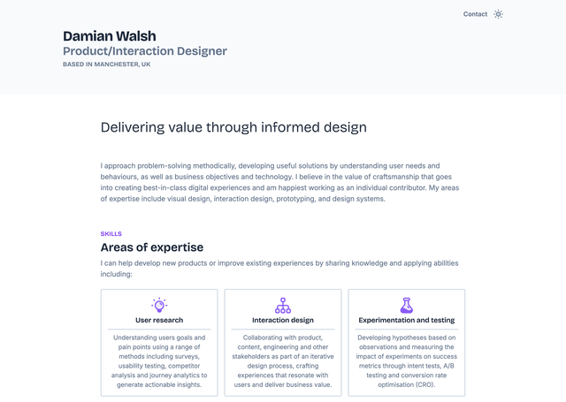
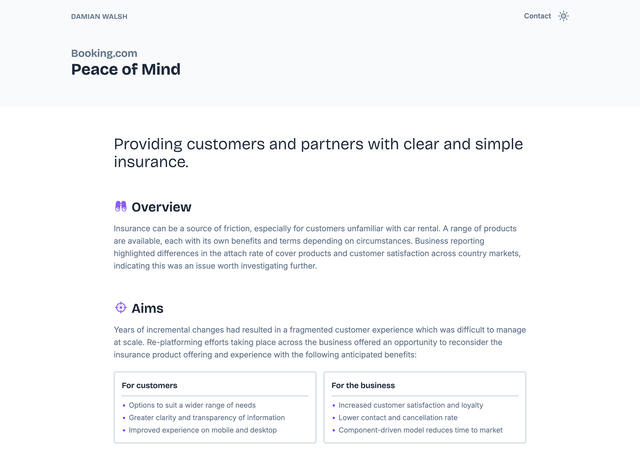
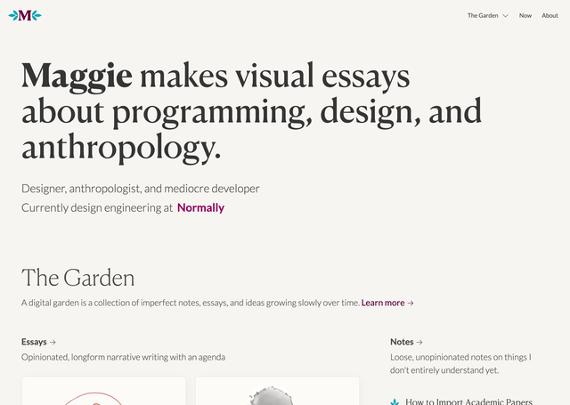
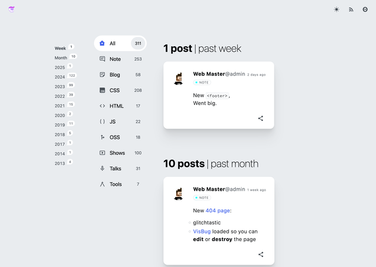
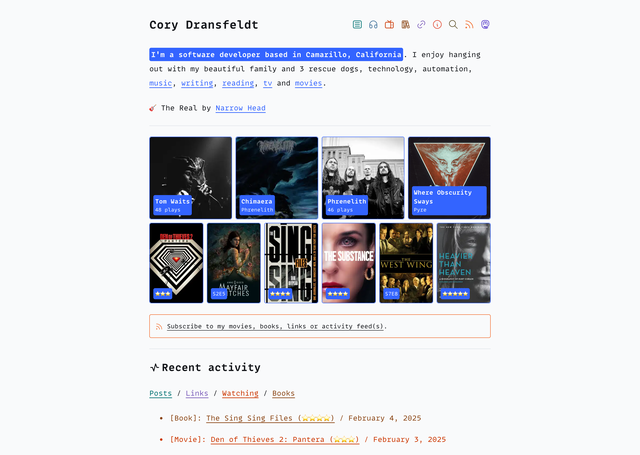


.screenshots {
  display: flex;
  flex-direction: column;
  gap: var(--flow-space);
  padding-inline: calc((100% - 75%) / 2);
  @media screen and (width >= 769px) {
    flex-direction: row;
    padding-inline: 0;
  }
}


Last year was a weird one—in fact, it's more accurate to say the entire period since the COVID-19 pandemic has been a distinctly odd time. I can’t recall any time in my career—which spans long enough to include the dot-com crash of 2000 (yes, I'm _that_ old) and the fallout from the financial crisis of 2007–2008—when workers have been stretched and squeezed so hard, for so long, in all directions.

## A burnt-out case
For me, this led to burnout and resulted in me walking away from a secure job in my chosen field—one I had invested significant time and effort building expertise in. At the time, I felt I had no choice. I barely understood what was happening myself, let alone be able to identify and articulate the root causes to an employer or advocate for change.

<figure>
  <blockquote>
  
"Burnout is a prolonged response to chronic emotional and interpersonal stressors on the job. It is defined by the three dimensions of exhaustion, cynicism, and professional inefficacy."

  </blockquote>
  <figcaption class="meta">C. Maslach, M.P. Leiter in, <a href="http://dx.doi.org/10.1016/B978-0-12-800951-2.00044-3">Stress: Concepts, Cognition, Emotion, and Behavior</a> (2016) pp.351-357</figcaption>
</figure>

Fortunately, I was in a position to support myself financially through a career break. I simply shut down and turned my attention elsewhere. During this time, one of the activities I found solace in was gardening (IRL)— foreshadowing my eventual path back to design.

Meanwhile, in the wider world there seemed to be a growing recognition and willingness to discuss the factors driving tech burnout. This [Medium article](https://medium.com/@silvercross313/the-true-cause-of-tech-burnout-9e49842db613), written in 2024 from an engineer's perspective, hits the nail squarely on the head. I’ve paraphrased excerpts below in case the link becomes unavailable:

- People want autonomy and control over their work, driven by a desire to learn, develop, and contribute more meaningfully over time. They want to feel like they're building a real career.
- Most tech work requires you to disregard your skills and training, and instead spend _less_ time creating _more_ things at _lower_ quality. Meanwhile, your knowledge grows increasingly outdated as technology evolves, and your job rarely provides opportunities to keep up-to-date with new developments.
- Speed emerges from proficiency—it's not a goal to pursue directly. When you focus on building proficiency, speed follows; focusing on speed alone won't make you faster. The tech industry, with its emphasis on short-term gains and quick wins, fails to grasp this fundamental principle.
- Burnout doesn't stem from intense work or long hours. It comes from trying to control outcomes that you have no control over. In the tech world, only a select few on the business and product side truly control outcomes—everyone else merely supports these individuals' beliefs.

Don't get me wrong—I've had positive experiences working in tech: challenging goals and engaging colleagues (and vice versa) who taught me a lot. Some challenges simply come with the territory, especially on large teams and projects with many moving parts. Collaborating with others inevitably requires compromise. For years, I not only accepted but thrived on all of this, including the frustrating parts. With the benefit of hindsight, though, I can now see how work situations similar to the ones described above and my own responses to them gradually wore down my enthusiasm and disconnected me from my sense of professional identity—with predictable consequences.

## Back to first principles
Taking career breaks can be a fulfilling experience, but nothing lasts forever. After a certain point, time away from work begins to generate its own kind of stress and anxiety. Towards the end of 2024, events forced me to start thinking on a more practical level about what I wanted to do with my professional life and the steps I could take to move in that direction.

<figure>
  <blockquote>
  
"If you don't like something, change it. If you can't change it, change your attitude."

  </blockquote>
  <figcaption class="meta">Maya Angelou</figcaption>
</figure>

While more recent experiences revealed what I want to avoid—the factors leading to burnout broadly described above—I needed to reach further back to what initially drew me to design, and more specifically, design for the web, to reconnect with the type of work I find meaningful and engaging. This led me back to the web’s fundamental building blocks (HTML, CSS & JS)—not just as tools but as creative mediums—and to the community of makers who approach their craft with genuine curiosity, treating learning through experimentation as valuable in itself rather than just as a means to an end.

## The trouble with portfolio websites
Looking back at my website from 2023 left me disappointed. Both the content and presentation poorly reflected my own interests and motivations.

<figure>
  

    
    
  

  <figcaption class="meta">Personal website circa 2023</figcaption>
</figure>

### Content
Case studies force you to look backward, reviewing past work instead of focusing on future growth. There's nothing fundamentally wrong with this type of exercise—I'm doing it right now. Looking back over the ground you've already covered can help you decide where you want to go next. The problem emerges when you apply the concept to real-world work examples.

Tech projects are typically carried out by regimented teams where work flows continuously like parts on a factory assembly line. Companies organise themselves this way believing it enables parallel work streams, faster delivery, and the flexibility to rotate specialists in, around, and back out as though through a revolving door. They may well be right about this but after you've been working this way for a while, you realise the work product is often incompatible with both your own growth needs and these same companies' hiring criteria, which are based on assessing attitude (how you think) and competence (what you do). These qualities are hard to showcase when you find yourself spread wafer-thin and/or pigeonholed with little say over your work, methods, or time management.

Most work contracts assign intellectual property (IP) rights to clients or employers and bind you to non-disclosure agreements—either in perpetuity or for such lengthy periods that they might as well be. When sharing is permitted, you'll likely sanitise your portfolio, portraying the work in the most flattering light possible to avoid offending anyone you’ve worked with. Meanwhile, "the business" will expect you to reduce the often messy trial and error process of creative work into formulas like: _Accomplished [X] as measured by [Y], by doing [Z]_.

### Presentation
While the case study format forces you to cast your gaze back with rose-tinted glasses, the standard organisation and presentation of content offers limited scope to explore beyond generic layout and flow patterns. For me, at least, these preconceived notions inevitably lead to two outcomes when designing a portfolio website: either cookie-cutter sites (like the previous version of this website, quickly assembled with Tailwind and plugins) or JS frameworks that are ill-suited for the task and encourage you down the path to smoke and mirrors.

Even when you set out with the best intentions, portfolio websites provide little motivation for ongoing development. The content inherently focuses on the past, while the standard presentation limits opportunities to explore creative possibilities and develop your craft. And there's the lingering doubt that presenting yourself this way risks perpetuating the same type of work and methods you're trying to move beyond.

When you feel constrained by both the work itself and the way you talk about and present it, what avenues remain open for personal expression and growth?

## Digital gardens
Digital gardens seem to offer an alternative path. But what exactly is a digital garden? How can these spaces provide a different model for personal expression and growth? And how does this relate to burnout?

### Surveying the landscape
Digital gardens are typically described as a personalised way of thinking, organising, and sharing, often serving as a means of escaping the orthodoxy of conventional social media or blogging platforms that place limits on content organisation and presentation. Maggie Appleton’s 2021 essay does a great job of tracing the history and describing the characteristics of digital gardens, while acknowledging that they are defined as much by their differences as their similarities.

<figure>
  <blockquote>
  
"Digital gardens should be just as unique and particular as their vegetative counterparts. The point of a garden is that it’s a personal playspace. You organise the garden around the ideas and mediums that match your way of thinking, rather than off someone else’s standardised template."

  </blockquote>
  <figcaption class="meta">Maggie Appleton. <a href="https://maggieappleton.com/garden-history">A Brief History & Ethos of the Digital Garden</a></figcaption>
</figure>

While all the themes covered in the essay and its references resonated, this particular quote stood out by offering a liberating alternative vision—one that contrasts with the portfolio model that often reflects the work environment instead of the individual. This shift in thinking was revelatory for me but is by no means revolutionary. A quick search reveals makers whose websites exemplify this approach.

  <figure>
    
    <figcaption class="meta"><a href="https://maggieappleton.com">Maggie Appleton</a></figcaption>
  </figure>
  <figure>
    
    <figcaption class="meta"><a href="https://nerdy.dev">Adam Argyle</a></figcaption>
  </figure>
  <figure>
    
    <figcaption class="meta"><a href="https://coryd.dev">Cory Dransfeldt</a></figcaption>
  </figure>

Each adopts different aspects of the same philosophy yet achieves distinct results shaped by their individual interests and motivations. So what are my own motivations for choosing this particular path?

### Planting new seeds
Burnout is a peculiar thing—the causes build imperceptibly over time, but the effects loom suddenly and seemingly out of nowhere, knocking you off balance and turning your life upside down. Given time, the exhaustion and cynicism dimensions of burnout—feeling drained of energy and idealism—fade away. While gardening (IRL) helps restore a sense of personal agency, burnout's most enduring and difficult effect to recover from is loss of self-belief. This digital garden project aims to address that by sweeping aside the factors that lead to burnout and returning to first principles, focusing on what _I believe in_ and _can control:_ having ideas and seeing them through from concept to completion, using the web's native languages as creative mediums, learning through experimentation, prioritising craftsmanship over speed, and presenting a more authentic professional identity based on my own interests and motivations. Its essential nature is perhaps best captured by the gardener's adage:

<figure>
  <blockquote>
  
"Look after your garden and your garden will look after you."

  </blockquote>
  <figcaption class="meta">Traditional saying</figcaption>
</figure>

I'm not sure what the future holds. While I remain optimistic about the web platform and community, the current direction the tech industry seems to be moving in, along with the job market and my place within it, looks uncertain. But that's OK—I've planted some seeds, and for now I'm content being a digital gardener.
