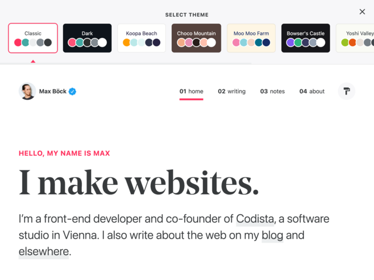
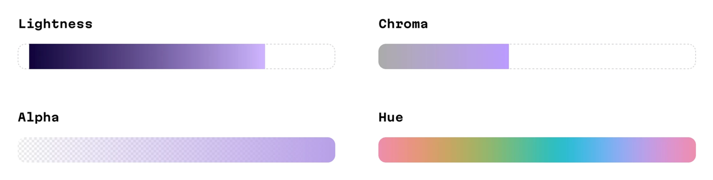


.screenshots {
  display: flex;
  flex-direction: column;
  gap: var(--flow-space);
  padding-inline: calc((100% - 75%) / 2);
  @media screen and (width >= 769px) {
    flex-direction: row;
    padding-inline: 0;
  }
}

.scheme-definitions,
.easing-equations {
  container-type: inline-size;
  margin-block-start: 0 !important;
  @container (min-width: 50ch) {
   dl {
      display: grid;
      grid-template-columns: auto 1fr;
      column-gap: var(--gutter);
    }
  }
  code {
    display: block;
  }
}

.chart,
.lookup-table {
  border-radius: var(--border-radius);
  display: flex;
  flex-direction: column;
  gap: var(--flow-space);
  padding: var(--flow-space);
}

table {
  width: 100%;
  table-layout: fixed;
  font-size: var(--text-size--1);
  td, th {
    padding: var(--space-3xs);

    &:nth-child(2) {
      text-align: center;
    }

    &:nth-child(3) {
      text-align: right;
    }
  }
}

Designers often seem to face extremes when selecting and using colours. At one end of the spectrum, brand guidelines limit you to a few colours chosen for specific applications, with additional colours added later—sometimes purely for aesthetics or where the reasons are unclear. Some of the colours might have tints and shades while others don't, and where variations exist, there could be inconsistent saturation and lightness levels across the palette. This makes it challenging to create colour-dependent components like buttons and form elements and their various states. At the other end lies complete creative freedom, which sounds ideal until you're paralysed by the range of possibilities. Consider standard colour picker interfaces: they offer a world of colour to explore but provide no map for navigation.

When I set out to design the latest version of this website, I knew selecting colours would be a challenge and that I could easily spend a lot of time fussing over choices. Rather than using Figma (or similar tools) for upfront design or relying on CSS frameworks with predefined colours, I wanted to take a different path. I'm quite fond of Figma and recognise the usefulness of CSS frameworks in certain situations, but these approaches don't align with my [aims for this project](https://damianwalsh.co.uk/posts/cultivating-a-digital-garden/)—which involve moving away from production-line thinking and towards embracing the web's native languages as creative mediums and learning through experimentation. I also had a vague notion, inspired by Max Böck's theme picker, of offering users control of display colour within some sensible parameters—e.g., foreground and background combinations that meet [WCAG 2.0 AA minimum contrast ratio requirements](https://www.w3.org/TR/UNDERSTANDING-WCAG20/visual-audio-contrast-contrast.html).

<figure>
  

    
    
  

  <figcaption class="meta">Theme picker on <a href="https://mxb.dev/">Max Böck's website</a></figcaption>
</figure>

While I was thinking about my colour dilemma, I was reading Brian Eno's 1995 diary [A Year with Swollen Appendices](https://damianwalsh.co.uk/reading/works/a-year-with-swollen-appendices-brian-eno/), where he quotes cybernetician Stafford Beer while discussing his approach to producing generative music.

<figure>
  <blockquote>
  
"Instead of trying to specify it in full detail, specify it only somewhat. You can then ride on the dynamics of the system in the direction you want to go."

  </blockquote>
  <figcaption class="meta">Stafford Beer</figcaption>
</figure>

This freewheeling line of thought was appealing—who wouldn't want to set a few parameters and let the system flow? It influenced my approach to every aspect of presentation—layout, typography, sizing, spacing, and colour. For now though, I want to focus on colour and how systems thinking can be applied to generating colours using modern CSS features.

## Colour theory
The foundations of [colour theory](https://en.wikipedia.org/wiki/Color_theory) establish a framework for creating colours that complement each other in [harmony](https://en.wikipedia.org/wiki/Color_scheme), serving as reliable parameters for systematically generating colours.

<dl>
  <dt>Complementary</dt>
  <dd>A complementary colour scheme consists of two colours positioned opposite each other on the <a href="https://en.wikipedia.org/wiki/Color_wheel">colour wheel</a>. A <em>split-complementary</em> scheme uses three colours: a base colour plus two colours that sit 150 and 210 degrees away from it.</dd>

  <dt>Analogous</dt>
  <dd>Analogous colour schemes use colours that are adjacent to each other on the colour wheel—typically a dominant primary or secondary colour with two complementary tertiary colours, positioned 30 degrees and 330 degrees from the base colour.</dd>

  <dt>Triadic</dt>
  <dd>The triadic colour scheme combines three colours: a base colour and two additional colours positioned 120 degrees and 240 degrees away from it on the colour wheel.</dd>

  <dt>Tetradic</dt>
  <dd>Tetradic schemes use four colours in two complementary pairs, with rectangle schemes using colours at 60, 180, and 240 degrees from the base colour, while square schemes space colours 90 degreed apart.</dd>

  <dt>Hexadic</dt>
  <dd>The hexadic colour scheme is a six-colour combination consisting of a base colour and five colours positioned at 60, 120, 180, 240, and 300 degrees from it on the colour wheel.</dd>
</dl>

## OKLCH colour notation
I really like OKLCH notation for thinking about and declaring colours. For me, at least, it's far more intuitive than previous formats, and there are additional benefits outlined in [OKLCH in CSS: why we moved from RGB and HSL](https://evilmartians.com/chronicles/oklch-in-css-why-quit-rgb-hsl) by Andrey Sitnik at Evil Martians, which is an excellent primer on the topic.

<figure>
  

    
  

  <figcaption class="meta">OKLCH axes</figcaption>
</figure>

In oklch(L C H) or oklch(L C H / a), each item corresponds as follows:

- __L__ is perceived __lightness__ (0-100%). “Perceived” means that it has consistent lightness for our eyes. It ranges from __0__ (black) to __1__ (white).
- __C__ is __chroma__, the saturation of colour. It goes from __0__ (gray) to the most saturated colour. For both P3 and sRGB the value will be always below __0.37__.
- __H__ is the __hue__ angle (0-360).
- __a__ is __opacity__ (0-1 or 0-100%).

## CSS custom properties
Custom properties (CSS variables) let you define reusable values. You can set them using either `@property` or the more common `--property-name: value;`  syntax, and access them using `var()`. A key feature of custom properties defined with two dashes (`--`) is that they cascade and inherit values from parent elements. For a detailed explanation, see the [MDN documentation on CSS custom properties](https://developer.mozilla.org/en-US/docs/Web/CSS/CSS_cascading_variables/Using_CSS_custom_properties).

## Putting theory into practice
Having established the foundations of using colour theory as basic parameters, then letting the system's dynamics flow, all that remains is to create a practical implementation using modern CSS that:

- Produces four complementary colours (a tetradic scheme) offering room for interesting variations and combinations.
- Generates [colour ramps](https://uxdesign.cc/how-to-create-a-color-ramp-used-in-design-systems-2edd5b93854c) for each hue, along with grayscale using corresponding lightness values.
- Allows users to adjust the base hue while other colours automatically change according to their angular relationships, leveraging the cascade and inheritance of custom properties.

  See the Pen <a href="https://codepen.io/damianwalsh/pen/pvojXYq/d56b2d955641ada1f87a0de51c12e687">
  Dynamic colour palettes with OKLCH and CSS custom properties</a> by Damian Walsh (<a href="https://codepen.io/damianwalsh">@damianwalsh</a>)
  on <a href="https://codepen.io">CodePen</a>.

While vanilla CSS could achieve the same results, I built this system with SASS, which offers several advantages:

- SASS loops and variables reduce repetition and enable dynamic value generation, making the code easier to update and maintain.
- Since most calculations happen during compilation, browsers have less work to do at runtime.

## Limitations of linear colour ramps
When applying this approach to a recent project, I discovered a limitation in the original implementation.

### Linear interpolation
The original system used equally spaced steps in lightness and chroma (saturation), which didn't match the desired visual effect in application.

  <h3 class="meta">Profiles with equally spaced steps</h3>
  <canvas id="linearChart"></canvas>

What I wanted was more tightly spaced steps at either end, particularly between light tints, to achieve a more subtle effect on backgrounds with more dramatic shifts appearing in the middle range.

### Perceptual calibration
My first attempt at finding a solution involved creating a [lookup table](https://en.wikipedia.org/wiki/Lookup_table) and hand-tuning the values to achieve the desired result.

  <h3 class="meta">Manual lookup table</h3>
  <table>
  <thead>
    <tr>
      <th>Step</th>
      <th>Lightness</th>
      <th>Chroma</th>
    </tr>
  </thead>
  <tbody>
    <tr>
      <td>1</td>
      <td>96</td>
      <td>0.02</td>
    </tr>
    <tr>
      <td>2</td>
      <td>91</td>
      <td>0.03</td>
    </tr>
    <tr>
      <td>3</td>
      <td>85</td>
      <td>0.04</td>
    </tr>
    <tr>
      <td>4</td>
      <td>71</td>
      <td>0.09</td>
    </tr>
    <tr>
      <td>5</td>
      <td>52</td>
      <td>0.13</td>
    </tr>
    <tr>
      <td>6</td>
      <td>42</td>
      <td>0.16</td>
    </tr>
    <tr>
      <td>7</td>
      <td>34</td>
      <td>0.18</td>
    </tr>
    <tr>
      <td>8</td>
      <td>24</td>
      <td>0.19</td>
    </tr>
    <tr>
      <td>9</td>
      <td>18</td>
      <td>0.2</td>
    </tr>
  </tbody>
</table>

While this approach creates a perceptually calibrated colour ramp, it has one major drawback: adding or removing steps, or changing any values, requires manually recalculating everything.

Out of curiosity, I plotted these values on a chart and was mildly surprised to see an S-curve appear.

  <h3 class="meta">Profiles created manually</h3>
  <canvas id="manualChart"></canvas>

This got me thinking about animation and how easing equations can be used to control the rate at which values change to create a more natural effect.

### Easing equations
Easing equations describe how values change over time. The most common curves are:

  <dl>
    <dt>Ease-In</dt>
    <dd>Starts slow, ends fast. <code>f(t) = t²</code></dd>
    <dt>Ease-In-Out</dt>
    <dd>Starts slow, accelerates in the middle, ends slow (an S-curve). <code>f(t) = t² (3 - 2t)</code></dd>
    <dt>Ease-Out</dt>
    <dd>Starts fast, ends slow. <code>f(t) = t (2 - t)</code></dd>
    <dt>Linear</dt>
    <dd>Constant speed, no acceleration. <code>f(t) = t</code></dd>
  </dl>

These mathematical functions can replace the manual lookup table entirely. Instead of defining fixed step increments, the system now works like this:

- Define number of steps and start and end points for lightness and chroma ranges
- For each step calculate a progress value from 0 to 1 and pass this through an easing function
- Use the eased value to interpolate between start and end points

The `ease-in-out` function produces an S-curve that closely matches the hand-tuned values in the lookup table, but with the added benefit of being precise and easily adjustable. Changing the curve requires only swapping one function name. Adjusting the range and number of steps means updating variables instead of recalculating all the values individually.

  <h3 class="meta">Profiles created with easing equation</h3>
  <canvas id="easingChart"></canvas>

  See the Pen <a href="https://codepen.io/damianwalsh/pen/ZYOMLpZ/d21285accbc454d0d1632c2b555ec0e8">
  Dynamic colour palettes with OKLCH and CSS custom properties</a> by Damian Walsh (<a href="https://codepen.io/damianwalsh">@damianwalsh</a>)
  on <a href="https://codepen.io">CodePen</a>.

## Aknowledgements
The original implementation drew inspiration from [Adam Argyle's](https://codepen.io/argyleink) related explorations on CodePen. The easing functions in the revised version were adapted from Robert Penner's [easing equations](https://robertpenner.com/easing/).


document.addEventListener('DOMContentLoaded', () => {
  // Global Chart.js settings
  Chart.defaults.font.size = 14;
  Chart.defaults.font.family = "Bricolage Grotesque Variable, system-ui, -apple-system, BlinkMacSystemFont, Segoe UI, Roboto, Helvetica Neue, Arial, Noto Sans, sans-serif";

  const axisStyles = {
    grid: { color: 'oklch(53.75% 0 0 / 40%)' },
    border: { color: 'oklch(53.75% 0 0 / 40%)' },
    ticks: { color: 'oklch(53.75% 0 0)' }
  };

  const colorPalette = [
    'oklch(53.75% 0.125 180)',
    'oklch(53.75% 0.125 240)'
  ];

  const linearData = {
    steps: [1, 2, 3, 4, 5, 6, 7, 8, 9],
    lightness: [96.75, 86, 75.25, 64.5, 53.75, 43, 32.25, 21.5, 10.75],
    chroma: [0.025, 0.05, 0.075, 0.1, 0.125, 0.15, 0.175, 0.2, 0.225]
  };

  const manualData = {
    steps: [1, 2, 3, 4, 5, 6, 7, 8, 9],
    lightness: [96, 91, 85, 71, 52, 42, 34, 24, 18],
    chroma: [0.02, 0.03, 0.04, 0.09, 0.13, 0.16, 0.18, 0.19, 0.2]
  };

  const easingData = {
    steps: [1, 2, 3, 4, 5, 6, 7, 8, 9],
    lightness: [96, 92.65, 83.81, 71.32, 57, 42.68, 30.19, 21.35, 18],
    chroma: [0.02, 0.03, 0.05, 0.08, 0.11, 0.14, 0.17, 0.19, 0.2]
  };

  const chartConfig = (data, title) => ({
    type: 'line',
    data: {
      labels: data.steps,
      datasets: [
        {
          label: 'Lightness',
          data: data.lightness,
          borderColor: colorPalette[0],
          backgroundColor: colorPalette[0],
          tension: 0.5,
          pointRadius: 4,
          pointStyle: 'circle',
          yAxisID: 'y'
        },
        {
          label: 'Chroma',
          data: data.chroma,
          borderColor: colorPalette[1],
          backgroundColor: colorPalette[1],
          tension: 0.5,
          pointRadius: 4,
          pointStyle: 'circle',
          yAxisID: 'y1'
        }
      ]
    },
    options: {
      responsive: true,
      maintainAspectRatio: true,
      aspectRatio: 2,
      interaction: {
        mode: 'index',
        intersect: false
      },
      scales: {
        x: {
          ...axisStyles,
          title: {
            display: true,
            text: 'Step'
          }
        },
        y: {
          ...axisStyles,
          type: 'linear',
          display: true,
          position: 'left',
          title: {
            display: true,
            text: 'Lightness'
          },
          min: 0,
          max: 100
        },
        y1: {
          ...axisStyles,
          type: 'linear',
          display: true,
          position: 'right',
          title: {
            display: true,
            text: 'Chroma'
          },
          min: 0,
          max: 0.25,
          grid: {
            drawOnChartArea: false
          }
        }
      }
    }
  });

  new Chart(document.getElementById('linearChart'),
    chartConfig(linearData, 'Linear Interpolation'));

  new Chart(document.getElementById('manualChart'),
    chartConfig(manualData, 'Manual Calibration: Lightness & Chroma'));

  new Chart(document.getElementById('easingChart'),
    chartConfig(easingData, 'Easing Equation: Lightness & Chroma'));
});

