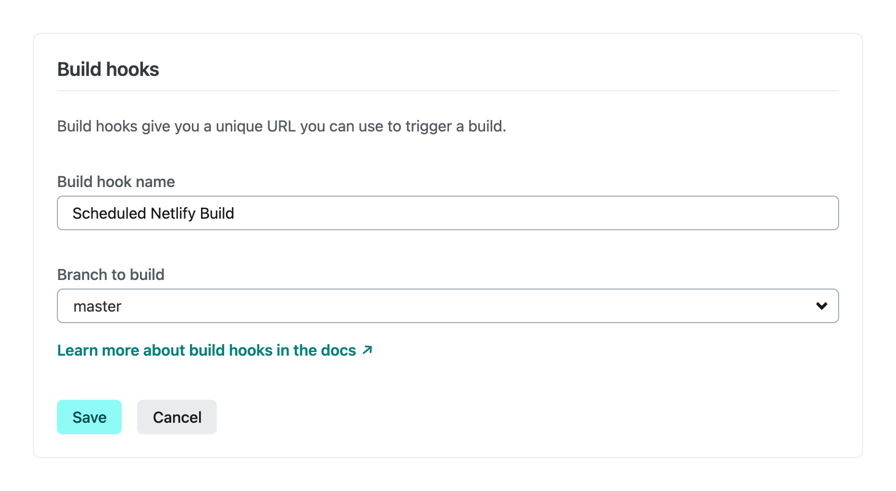
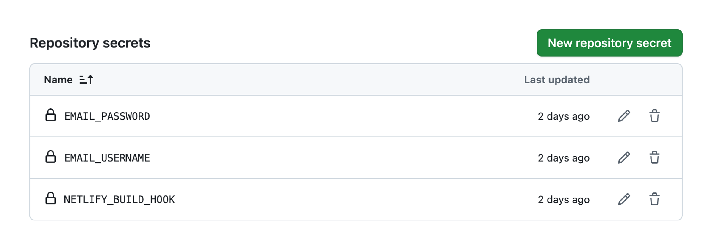


.screenshots {
  display: flex;
  flex-direction: column;
  gap: var(--flow-space);
  padding-inline: calc((100% - 75%) / 2);
  @media screen and (width >= 769px) {
    flex-direction: row;
  }
  &.no-pad {
    padding-inline: 0;
  }
}

When I first built and released the latest iteration of this website with [Eleventy](https://www.11ty.dev/) in January 2025, my workflow went something like this: to make changes, I would run the dev server locally with `npm run dev`, then when I was happy, I'd trigger a build with `npm run build`, which produces a production-ready build in the `_site` directory.

**package.json**

```json
{
  "type": "module",
  "scripts": {
    "dev": "eleventy --serve",
    "build": "eleventy"
  },
  "dependencies": {
    "@11ty/eleventy": "^3.0.0"
  }
}
```

When I wanted to release the changes (i.e., put them on my live website), I would push the code to [GitHub](https://github.com/), *including* the output site directory. [Netlify](https://www.netlify.com/), which I use to host my website, would then automatically deploy it. This process works by [connecting a GitHub repository to a Netlify website](https://www.netlify.com/blog/2016/09/29/a-step-by-step-guide-deploying-on-netlify/).

**netlify.toml**

```toml
[build]
  publish = "_site"
  command = ""
```

In the root of my project, this file tells Netlify what to do, which in this case is simply copy the locally built `_site` directory whenever it's pushed to GitHub. And that was it—a [Continuous Deployment (CD)](https://en.wikipedia.org/wiki/Continuous_deployment) workflow. This method of deployment is straightforward, works great with [static site generators](https://en.wikipedia.org/wiki/Static_site_generator) like Eleventy, and served me well while I found my feet.

Fast-forward six months. After gaining knowledge by getting involved in the Eleventy community and confidence through writing and publishing posts, developing new features, and releasing updates, I began to notice some minor irritations. One of the key benefits of static sites is that they are, well, *static.* Generating everything up-front typically results in faster client-side loading times, but they won't update unless you tell them to. Looked at in another way, this could also be perceived as a drawback, for example if there's anything on the website that might require updating more frequently than your regular deployment workflow accounts for.

For argument's sake, let's say you wanted to display [Webmentions](https://indieweb.org/Webmention) on your blog and have new comments, reposts, and likes on any of your posts update every 24 hours. You could still always manually deploy, but this requires greater discipline in managing your local changes to avoid pushing half-baked content or features live at the same time. Another approach is to set up an automatic deployment that shifts the process of generating the production-ready `_site` directory away from your local environment.

## Automating builds and deployment
This method allows deployments to be triggered manually by pushing new content and features to GitHub. Meanwhile, the automatic system works in the background, triggering remote builds on a schedule and notifying you when it was successful or if it encountered problems.

### Creating a Netlify build hook
- Log in to Netlify
- Navigate to the site dashboard
- Go to Project configuration > Build & deploy > Build hooks
- Click "Add build hook"
- Give it a name like "Scheduled Netlify Build"
- Select the branch to build (usually "main" or "master")
- Click "Save" and copy the generated URL (it will look like: [`https://api.netlify.com/build_hooks/123abc456def`](https://api.netlify.com/build_hooks/123abc456def))

<figure>
  <div class="screenshots">
    
  </div>
  <figcaption class="meta">Creating a build hook in the Netlify dashboard</figcaption>
</figure>

### Adding GitHub Secrets
For email notifications, you'll need to securely store your email credentials. You could set up notifications through other channels, but email works for me.

- Log in to GitHub and find the repository
- Go to Settings > Secrets and variables > Actions
- Click "New repository secret" and add the following secrets:
    - Name: NETLIFY_BUILD_HOOK, Value: the build hook URL copied from Netlify
    - Name: EMAIL_USERNAME, Value: your email address
    - Name: EMAIL_PASSWORD, Value: your email password or app-specific password

<figure>
  <div class="screenshots">
    
  </div>
  <figcaption class="meta">Adding repository secrets in GitHub settings</figcaption>
</figure>

### Creating a GitHub Workflow
Next, create a GitHub Actions workflow in your project. Create the directory structure if it doesn't already exist, then add the file.

**.github/workflows/scheduled-build.yml**

```yaml
name: Scheduled Netlify Build

on:
  schedule:
    # Runs every day at midnight UTC
    - cron: '0 0 * * *'
  # Optional: Allow manual triggering
  workflow_dispatch:

jobs:
  build:
    runs-on: ubuntu-latest
    steps:
      - name: Trigger Netlify Build
        id: netlify-build
        run: |
          RESPONSE=$(curl -k -s -o response.txt -w "%{http_code}" -X POST -d {} ${{ secrets.NETLIFY_BUILD_HOOK }})
          if [ "$RESPONSE" -eq 200 ] || [ "$RESPONSE" -eq 201 ]; then
            echo "build_status=success" >> $GITHUB_OUTPUT
            echo "Netlify build triggered successfully"
          else
            echo "build_status=failure" >> $GITHUB_OUTPUT
            echo "Failed to trigger Netlify build. Response code: $RESPONSE"
            cat response.txt
            exit 1
          fi

      - name: Send email notification
        if: always()
        uses: dawidd6/action-send-mail@v3
        with:
          server_address: your-smtp-server-name
          server_port: your-smtp-server-port-number
          secure: false
          username: ${{ secrets.EMAIL_USERNAME }}
          password: ${{ secrets.EMAIL_PASSWORD }}
          subject: Netlify Scheduled Build ${{ steps.netlify-build.outputs.build_status == 'success' && 'Started' || 'Failed' }}
          body: |
            The scheduled Netlify build was ${{ steps.netlify-build.outputs.build_status == 'success' && 'triggered successfully' || 'failed to trigger' }}.

            Time: ${{ format(github.event.repository.pushed_at, 'dddd, MMMM Do YYYY, h:mm:ss a') }}
            Repository: ${{ github.repository }}

            View build status in Netlify dashboard:
            https://app.netlify.com/sites/your-netlify-site-name/deploys
          to: ${{ secrets.EMAIL_USERNAME }}
          from: GitHub Actions
```

The workflow uses the build hook to trigger Netlify to automatically rebuild the site remotely at midnight UTC daily and send email notifications about whether the build was successfully triggered, not whether the actual build and deployment succeeded—this can be configured in Netlify's notification settings.

### Configuring the project for remote builds
Finally, update Eleventy's configuration files to account for the transition to a remote build process:

**package.json**

```json
{
  "type": "module",
  "scripts": {
    "dev": "eleventy --serve",
    "build": "eleventy"
  },
  "dependencies": {
    "@11ty/eleventy": "^3.0.0",
    "netlify-plugin-cache": "^1.0.3",
  }
}
```

The `netlify-plugin-cache` package enables Netlify to maintain a persistent cache between builds, improving build times for subsequent deployments.

**netlify.toml**

```toml
[build]
  publish = "_site"
  command = "npm run build"
[[plugins]]
package = "netlify-plugin-cache"

  [plugins.inputs]
  paths = [
    ".cache"
  ]
```

Adding the `npm run build` command tells Netlify to build the site remotely instead of simply copying the locally built version. The `plugins` and `plugins.inputs` sections configure persistent caching and specify which directories to cache between builds. This prevents Eleventy from reprocessing unchanged assets on each build. If you're using additional plugins like [Eleventy Image](https://www.11ty.dev/docs/plugins/image/), remember to add their output directories to the paths array as well.

**.gitignore**

```toml
_site/
node_modules/
.cache
```

Now that the site is built remotely on Netlify's servers, the `_site` directory no longer needs to be committed to the GitHub repository and can be added to `.gitignore` and removed from Git tracking with `git rm -r --cached _site`.

And that's it! After committing and pushing these changes to GitHub, the workflow appears under the Actions tab of the repository. From there, it can be triggered manually as needed, and will also run automatically on the daily schedule.

## Acknowledgements
Thanks to [Sia](https://sia.codes/) and [Vrugtehagel](https://vrugtehagel.nl/), whose comments and advice in the [Eleventy Discord](https://discord.com/invite/GBkBy9u) introduced me to [scheduling deployments](https://www.voorhoede.nl/en/blog/scheduling-netlify-deploys-with-github-actions/) and using [disk caching to speed up builds](https://www.11ty.dev/docs/deployment/#persisting-cache).
